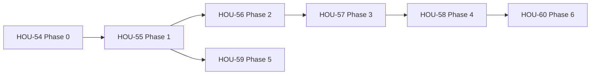

# Linear delivery: import pipeline FP migration

## Purpose

Incremental, behaviour-neutral refactor of `backend/src/services/import/` to a **pure planning core** using **lodash** collection patterns (via `utils/lodashImport.ts`). Reduces cognitive load in parse, clustering, and persist-plan assembly without rewriting orchestration, persist, or DBSCAN.

Authoritative design: [`import_fp_migration.md`](../../03_detailed_design/import_fp_migration.md) (extends [`import_transaction_files.md`](../../03_detailed_design/import_transaction_files.md) §4.1 / §4.5).

## Linear workspace

- **Team:** House f3 (key **HOU**).
- **Project:** [Import pipeline FP migration](https://linear.app/house-f4/project/import-pipeline-fp-migration-e803b4234a31).

## Execution order

**Suggested first PR:** HOU-54 + HOU-55 together (lodash foundation + immutable negation).

## Story backlog

| Issue | Phase | Title | Priority | Blocks |
| ----- | ----- | ----- | -------- | ------ |
| [HOU-54](https://linear.app/house-f4/issue/HOU-54) | 0 | Add lodash and lodashImport re-export module | High | — |
| [HOU-55](https://linear.app/house-f4/issue/HOU-55) | 1 | Immutable parse and canonical amount transforms | High | HOU-54 |
| [HOU-56](https://linear.app/house-f4/issue/HOU-56) | 2 | Introduce PlanningRow model for index alignment | High | HOU-55 |
| [HOU-57](https://linear.app/house-f4/issue/HOU-57) | 3 | Decompose cluster pass with lodash transforms | High | HOU-56 |
| [HOU-58](https://linear.app/house-f4/issue/HOU-58) | 4 | Extract buildPersistPlan pure module | Medium | HOU-57 |
| [HOU-59](https://linear.app/house-f4/issue/HOU-59) | 5 | Refactor pairing ingest with lodash | Medium | HOU-55 |
| [HOU-60](https://linear.app/house-f4/issue/HOU-60) | 6 | Shell cleanup and migration doc sign-off | Low | HOU-58 |

## Risks / assumptions

- **Phase 3** is highest risk — keep `physicalGroupLabels` test hook; integration tests must stay green each PR.
- lodash imports are **named only** via `utils/lodashImport.ts` (curated surface).
- One PR per issue unless combining Phase 0 + 1 for a smaller first review.

## Out of scope

- fp-ts, Effect, Ramda, orchestration pipeline DSL
- DBSCAN, embedder lifecycle, blob storage, persist choreography rewrites
- API or Dynamo schema changes

## Maintenance

When completing a phase, check off success criteria in [`import_fp_migration.md`](../../03_detailed_design/import_fp_migration.md) §9 and update implementation pointers in [`import_transaction_files.md`](../../03_detailed_design/import_transaction_files.md) if new modules are added.
