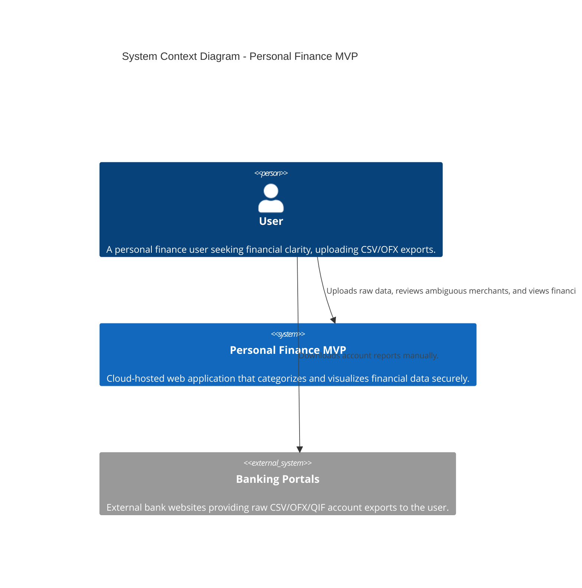

# System Context

This diagram provides a high-level overview of how the MVP Personal Finance system interacts with users and external entities. For the MVP, we skip direct API bank syncing (Open Banking) in favor of user-driven data exports.

