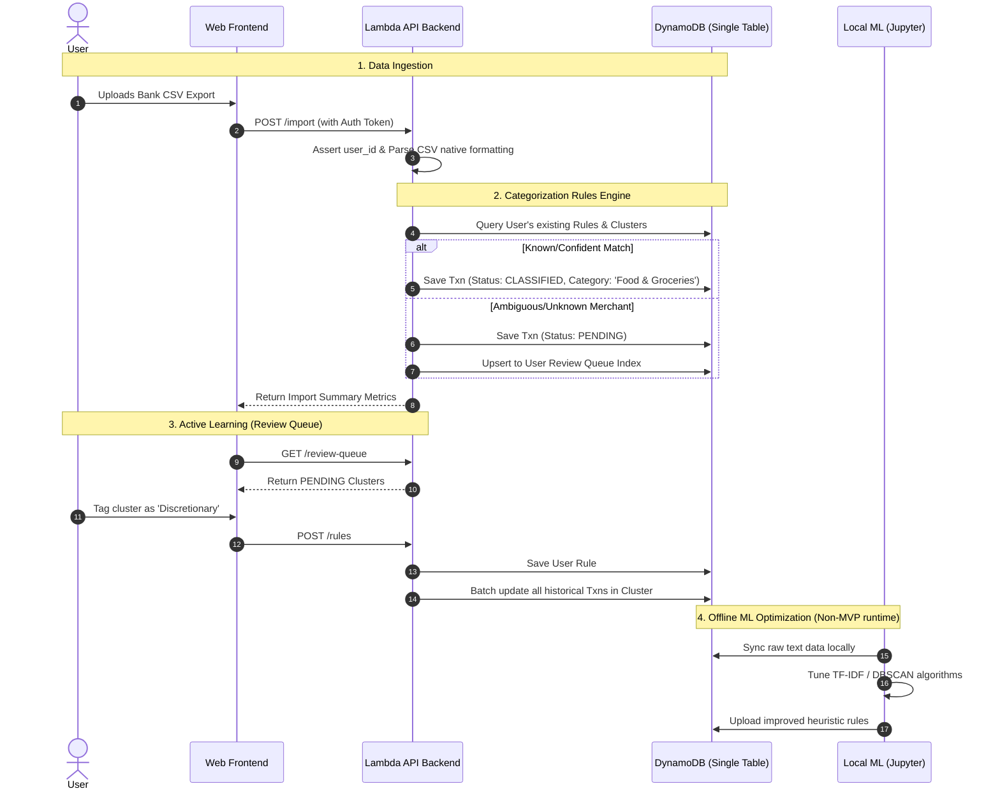

# Data Flow: Ingestion & Active Learning

This diagram illustrates the core MVP workflow: how a user uploads data, how the system parses it and attempts automated mapping, and how the "User Review Queue" facilitates Active Learning.

It also highlights the off-line ML environment (as decided by the Transaction Analysis expertise) to avoid expensive cloud iterations.

