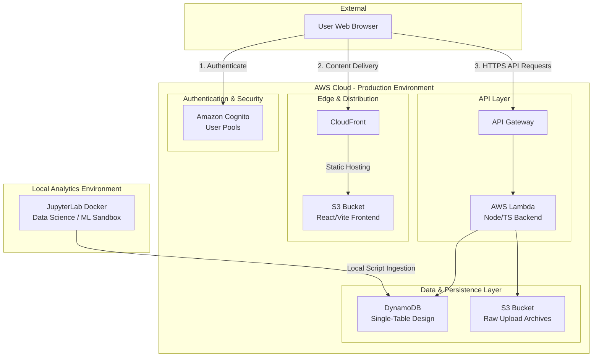

# MVP Cloud Infrastructure Map

This diagram outlines the low-cost, serverless AWS infrastructure required for the MVP, ensuring high scalability and near-zero idle compute costs in alignment with our expert directives.

## Architecture Decisions

1. **Authentication (Cognito)**: Manages multi-tenancy securely. Every API request receives a verified JWT containing the `user_id`.
2. **Compute (Lambda & API Gateway)**: Serverless execution. We only pay when functions run. There are no expensive always-on API servers.
3. **Database (DynamoDB)**: Fulfills the single-table, low-cost requirements. Utilizes `user_id` as the primary partition key for strict multi-tenant data isolation.
4. **Local ML Environment**: The `Jupyter` instance runs exclusively on local developer machines to execute exploratory DBSCAN/clustering without incurring AWS EC2 charges.
