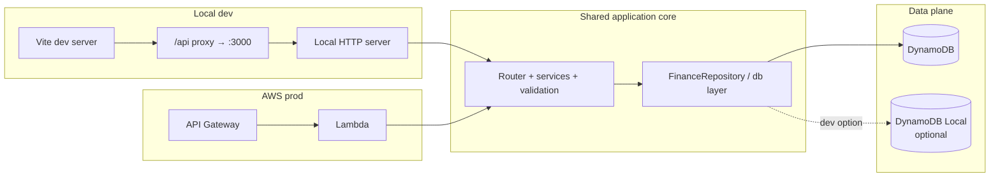
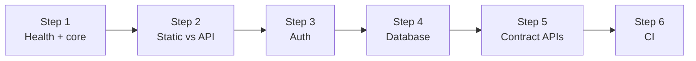

# Backend: Local Development and AWS Production

This document recommends how to run the **same backend codebase** comfortably on a **local machine** for day-to-day development while deploying to **AWS** for production (and optionally for shared staging). It complements the high-level layout in [`03_infrastructure_map.md`](../02_architecture/03_infrastructure_map.md) and the HTTP contract in [`api_contract.md`](./api_contract.md).

**Implementation order:** Follow **§14** top to bottom—**hello world and shared core → edge routing (static vs API) → auth → database → contract features → CI guardrails**. Earlier sections (§§3–13) are reference material; §15 describes modular seams that apply at every step.

## 1. Goals

| Goal | What “good” looks like |
|------|------------------------|
| **Fast iteration** | Change handler/service code, hit `/api/...` from the Vite dev server without deploying to Lambda. |
| **Behavioral parity** | Local and prod share routing, validation, repository calls, and JSON shapes—only *wiring* (HTTP adapter, auth extraction, config) differs. |
| **Safe separation** | Production data and credentials are never the default for local dev; mistakes are hard or loudly wrong. |
| **Observable contract** | The frontend keeps using relative `/api/...` URLs; locally that continues to proxy to the backend port as documented in `api_contract.md`. |

## 2. Current baseline (repo today)

- **Production-shaped runtime**: `backend/src/index.ts` exports the Lambda `handler`, which delegates to `lambdaHandler` in `backend/src/adapters/lambda.ts`. That adapter maps API Gateway events into an internal request shape and calls shared `dispatch()` in `backend/src/dispatch.ts`. Authenticated user resolution from the API Gateway authorizer context is implemented in the Lambda adapter for when protected routes arrive; `dispatch` is currently health-only.
- **Local HTTP adapter**: `backend/src/adapters/localServer.ts` is a small Node `http` server that adapts `IncomingMessage` into the same internal shape and calls `dispatch()`—so local and Lambda share routing and JSON handlers without duplicate route tables.
- **Data access**: `db/src/dynamoClient.ts` uses the AWS SDK default credential chain and `DynamoDBClient` with no local endpoint today—so local runs that hit DynamoDB **must** either supply credentials + table name (real or emulator) or you extend the client for DynamoDB Local. The Step 1 `/api/health` path does not call `@housef4/db` yet; repository usage lands in later implementation steps (see §14).
- **Frontend**: Vite proxies `/api` to `http://localhost:3000` (see `frontend/vite.config.ts`), matching the API contract’s local story.

The split—**thin adapters** (Lambda, local HTTP) plus **transport-agnostic `dispatch()`**—is in place. The sections below spell out how to extend that seam with auth enforcement, DynamoDB-backed handlers, CI, and production edge routing as you follow §14.

## 3. High-level picture

**Rule:** Business logic lives in **services** (and validation in **models/schemas**); **two adapters** connect that core to (1) local HTTP and (2) Lambda + API Gateway.

## 4. Environment model

Use an explicit **`APP_ENV`** (or `NODE_ENV` with care) so code does not guess from “am I in Lambda?” alone:

| Value | Purpose |
|-------|---------|
| `local` | Developer laptop; may use DynamoDB Local or a dedicated dev table in AWS. |
| `staging` | Optional; shared AWS account/resources, mirrors prod topology. |
| `production` | Live users; strict auth, real Cognito, prod table, no debug shortcuts. |

Avoid encoding behavior only with `typeof process.env.AWS_LAMBDA_FUNCTION_NAME` except for Lambda-specific concerns (cold start logging, etc.). Feature behavior should follow **`APP_ENV`** and explicit feature flags.

## 5. Configuration (12-factor)

Centralize configuration in one module used by both entry points. Suggested variables:

| Variable | Local | Production | Notes |
|----------|-------|------------|--------|
| `APP_ENV` | `local` | `production` | Drives auth bypass rules, logging verbosity. |
| `DYNAMODB_TABLE_NAME` | Required once DB is wired (**§14 Step 4**) | Set in Lambda env from Terraform | Omit for **§14 Steps 1–3** if no repository calls. |
| `AWS_REGION` | e.g. `eu-west-2` | Same | Keep aligned with Terraform `aws_region`. |
| `DYNAMODB_ENDPOINT` | e.g. `http://localhost:8000` | *unset* | When set, SDK client uses local emulator. |
| `COGNITO_*` / `AWS_COGNITO_*` | Optional | Required for verifying JWTs if you validate in Lambda | Only needed if the local server verifies real JWTs. |
| `DEV_AUTH_USER_ID` | Optional fixed UUID/sub | *never set* | See §6; **omit in prod** via Terraform/IaC guardrails. Used from **§14 Step 3** onward for local dev. |

**Production safety:** In Terraform, set Lambda environment only from managed variables; never copy `.env` from a laptop. For local work, use `.env.local` (gitignored) or shell exports.

## 6. Authentication strategy

**Production (target):** API Gateway HTTP API or REST API with a **Cognito JWT authorizer**. Lambda receives `requestContext.authorizer` claims; your existing `getAuthenticatedUserId` pattern stays valid.

**Local development (recommended options, pick one primary):**

1. **Real JWT, local verification (best parity)**  
   Point the local server at the same Cognito User Pool (JWKS URL + issuer + audience). The frontend logs in through Cognito-hosted UI or a dev callback; the browser sends `Authorization: Bearer <token>`; the local server validates the JWT like prod.  
   *Pros:* Same auth path as prod. *Cons:* Requires network and Cognito setup for every dev session.

2. **Dev-only static subject (fastest)**  
   When `APP_ENV=local` **and** e.g. `DEV_AUTH_USER_ID` is set, treat that value as `userId` and skip JWT validation. Optionally require a second flag `ALLOW_DEV_AUTH_BYPASS=true` so accidental use in prod fails closed.  
   *Pros:* No Cognito round-trip while building parsers and DB queries. *Cons:* Must be **strictly blocked** in staging/production.

3. **Middleware shim**  
   Accept a header like `X-Dev-User-Id` only when `APP_ENV=local`. Same guardrails as (2).

**Recommendation:** Use **(2) or (3) for routine API and import work**, and **(1) for periodic “auth integration” checks** or before release. Document the chosen mode in the backend README so the team configures the frontend (e.g. attach token vs leave anonymous with proxy).

## 7. Data plane: DynamoDB locally

Three supported patterns:

| Pattern | When to use | Pros | Cons |
|---------|-------------|------|------|
| **A. DynamoDB Local (Docker)** | Default for most feature work | No AWS spend; fast reset; offline | Emulator quirks; backup/replication differ from AWS |
| **B. Dedicated dev table in AWS** | When you need AWS-only behavior | True service parity | Requires IAM credentials; risk of clutter if table shared carelessly |
| **C. Local pointing at “real” dev account** | Small team, single dev table | Simple mental model | Must enforce naming like `housef4-dev-table` from Terraform |

**SDK wiring:** Extend `getDocumentClient()` (or a factory next to it) so when `DYNAMODB_ENDPOINT` is set, `DynamoDBClient` is constructed with `endpoint: process.env.DYNAMODB_ENDPOINT` and, for Local, `credentials: { accessKeyId: 'local', secretAccessKey: 'local' }` (or the emulator’s expected dummy creds). When unset, keep current default provider chain for Lambda.

**Table schema:** The single-table design (`PK`, `SK`, `GSI1`, etc.) must exist in the emulator; provide a **one-time setup script** or `docker-compose` that runs DynamoDB Local and applies `CreateTable` consistent with [`infrastructure/main.tf`](../../infrastructure/main.tf).

## 8. Local HTTP server (concrete behavior)

Recommended responsibilities:

1. Listen on **port 3000** (matches Vite proxy and `api_contract.md`).
2. Mount routes under **`/api`** (or strip prefix so handlers match API Gateway stage paths—stay consistent with how API Gateway passes `path`).
3. Parse JSON and `multipart/form-data` for `POST /api/imports` per contract.
4. Build a minimal **internal request object** `{ method, path, headers, rawBody / stream, userId }` and pass to shared router.
5. Map thrown validation errors to **4xx** and unexpected errors to **5xx** with the same JSON error envelope you plan for prod.

### Cross-origin (CORS) — when it applies

Browsers block cross-origin responses unless the API sends the right CORS headers (and answers **OPTIONS** preflight when required). This plan is designed so **CORS usually does not block you**, but you need to know the exceptions.

| Scenario | Same-origin from the browser? | CORS work |
|----------|------------------------------|-----------|
| **Local dev + Vite proxy** (`fetch('/api/...')` to `http://localhost:5173`) | **Yes** — the browser only talks to Vite; the proxy forwards server-side to `:3000`. | **None** for normal `/api` usage. |
| **Local dev** — SPA opened on `localhost:5173` but fetches **`http://localhost:3000/api/...` directly** | **No** (different port = different origin). | Local HTTP server must send CORS (e.g. `Access-Control-Allow-Origin: http://localhost:5173` or dev-only `*`) and handle **OPTIONS** for preflight when you use non-simple methods/headers. |
| **Production** — CloudFront serves SPA **and** routes **`/api/*`** to API Gateway on the **same hostname** (recommended in Step 2) | **Yes** for `fetch('/api/...')`. | **None** for that shape. |
| **Production** — SPA on one hostname (e.g. `www.…`) and API on another (`*.execute-api.…` or `api.…`) | **No**. | Configure **CORS on API Gateway** (HTTP API: built-in `cors` block; REST API: OPTIONS + gateway responses or Lambda). Allow **`Authorization`**, **`Content-Type`**, and any custom headers your SPA sends; allow methods you use (`GET`, `POST`, …). |

**Preflight:** `POST` with `multipart/form-data` for imports, or requests with `Authorization`, typically trigger **OPTIONS**. API Gateway (or your local server) must respond to preflight before the real request succeeds.

**Where logic lives:** Prefer **one** place per environment—API Gateway / HTTP API CORS settings in AWS; a small middleware on the **local HTTP adapter only** (§15 transport seam), not inside domain services.

## 9. AWS production path (no surprises)

Keep the current topology:

- **API Gateway** → **Lambda** (Node.js 20.x or team standard) with env `DYNAMODB_TABLE_NAME` and IAM role allowing `dynamodb:GetItem`, `Query`, `PutItem`, etc., on the table ARN from Terraform.
- **Cognito** authorizer attaches JWT claims to `requestContext`.
- Optional **S3** for raw uploads if imports archive to bucket (per infrastructure evolution).

**Packaging:** Build `backend` with `tsc`, bundle if desired (esbuild) for smaller cold starts; Terraform or CI uploads artifact. Same compiled code should be runnable locally (`node dist/local-server.js`) for parity.

## 10. Secrets and credentials

| Location | Practice |
|----------|----------|
| Laptop | AWS SSO or named profile for **dev account only** if using pattern B/C; never long-lived root keys in repo. |
| Lambda | IAM role; no static AWS keys in env. |
| Cognito | Pool IDs / app client IDs are public config; client secrets (if any) only in secure storage or env—not in git. |

## 11. Observability

- **Local:** `pino`/`console` structured logs with `requestId` replaced by a random UUID per HTTP request.
- **Prod:** Use `context.awsRequestId` (already logged in `index.ts`) and CloudWatch Logs; consider ADOT or Powertools later.

Keep log shapes similar so grep skills transfer from laptop to CloudWatch.

## 12. Alignment with existing documentation

- **Infrastructure map:** Production remains CloudFront + S3 for SPA, API Gateway + Lambda + DynamoDB for API—local dev inserts only the **HTTP adapter** and optional **DynamoDB Local** on the left of the diagram.
- **`api_contract.md`:** Paths, methods, and JSON rules are unchanged; only base URL differs (proxy handles it).
- **`db/` package:** Remains the single persistence abstraction; environment-specific client configuration is the only extension.

## 13. Risks and mitigations

| Risk | Mitigation |
|------|------------|
| Local bypass auth leaks to prod | Guard with `APP_ENV === 'local'` **and** assert `DEV_AUTH_USER_ID` unset in CI for production bundles; Terraform does not set bypass flags. |
| DynamoDB Local diverges from AWS | Periodic integration tests against a throwaway dev table; document known emulator gaps. |
| Two copies of routing (Lambda + Express) drift | One **router table** or shared `dispatch(event)` function used by both adapters. |
| Wrong table name in local `.env` | Prefix convention `housef4-local-*` vs `housef4-prod-table`; add startup log line printing table name and region. |
| Browser “blocked by CORS” | Follow §8 matrix: prefer Vite proxy locally and **same-host** `/api/*` behind CloudFront in prod; otherwise configure API Gateway + local server CORS and **OPTIONS**, including **`Authorization`** when Step 3 is on. |

## 14. Implementation plan (single flow)

Build in order. Each step should leave something **runnable** before you continue. Keep **one** `dispatch` (or router) and **thin** Lambda and local-HTTP wrappers throughout—see §15.

---

### Step 1 — Hello world, shared core, local + Lambda

**Goal:** Prove the same application logic runs **locally** (HTTP on port **3000**, §8) and **in AWS** (API Gateway → Lambda) with **no** Cognito and **no** DynamoDB on this route.

| Deliverable | Notes |
|-------------|--------|
| **`dispatch` + routing** | One place maps `method` + `path` to handlers; normalize errors to JSON + status. Start with **`GET /api/health`** (or `/health` under `/api`—stay consistent with API Gateway path config). |
| **Config module** | Reads `APP_ENV` and future vars (§5); avoid scattered `process.env` in services. |
| **Lambda wrapper** | `handler` adapts `APIGatewayEvent` → internal request → `dispatch` → `APIGatewayProxyResult`. |
| **Local HTTP wrapper** | Same `dispatch`; listen on **3000** so Vite’s `/api` proxy works. |
| **Auth stub** | Health stays **public**: no `userId` required yet. |

**Repo caveat:** Today’s `backend/src/index.ts` may enforce auth and call `getFinanceRepository()`. For Step 1, **`/api/health`** returns static JSON only; keep other behavior behind env or move it to later steps—remove temporary branches when Step 3–4 land.

**Done when:** `curl http://localhost:3000/api/health` and `curl` against the AWS invoke URL both return the same JSON; a unit test can call `dispatch` without HTTP or Lambda.

---

### Step 2 — Static frontend vs API routing (AWS edge)

**Goal:** Match [`03_infrastructure_map.md`](../02_architecture/03_infrastructure_map.md): browser loads SPA from S3 via CloudFront; **`/api/*`** hits API Gateway (same Lambda as Step 1 for now).

| Deliverable | Notes |
|-------------|--------|
| **CloudFront** | Default behavior → S3 (React/Vite build). Path pattern **`/api/*`** (or agreed prefix) → API Gateway origin. |
| **Path alignment** | API Gateway stage/path must match what `dispatch` expects (`/api/health` vs `/health` + strip prefix—pick one and document). |
| **Local dev** | Unchanged: Vite proxies `/api` to `localhost:3000` → **no browser CORS** for `/api` (see §8 CORS table). |
| **CORS in prod** | If CloudFront **and** API Gateway share one host + path routing (`/api/*`), CORS is usually **unnecessary**. If the API has its **own** origin, add API Gateway CORS (and test OPTIONS) **before** Step 3 adds `Authorization`, or preflight will fail. |
| **Split-origin dev** | If the app ever calls the API by full URL on `:3000`, implement CORS on the local server (§8). |

**Done when:** Deployed SPA loads; from the browser, `fetch('/api/health')` (or equivalent) reaches Lambda and returns Step 1 JSON.

---

### Step 3 — Authentication

**Goal:** Protect real routes in AWS; keep local development fast.

| Deliverable | Notes |
|-------------|--------|
| **Cognito User Pool + app client** | For JWT issuer / JWKS used by API Gateway. |
| **API Gateway JWT authorizer** | Attached to **`/api/*`** (or `ANY /api/{proxy+}`); **no** authorizer on `/api/health` if you want a public health check—otherwise protect everything. |
| **Lambda `userId`** | Read `sub` from `requestContext.authorizer` (see existing `getAuthenticatedUserId` pattern). |
| **Local dev** | `APP_ENV=local` + `DEV_AUTH_USER_ID` (§6); **never** set bypass vars in Terraform prod. |
| **Frontend** | One API client module: **no** bearer token for local proxy; **attach** Cognito access/id token in deployed builds (`import.meta.env` or build flag). |
| **CORS + JWT** | If the browser talks to the API **cross-origin**, API Gateway CORS must **`allow_headers`** include **`authorization`** (and any other request headers you set); retest **OPTIONS** after enabling the authorizer. |

**Done when:** In AWS, a missing/invalid JWT returns **401** on protected routes; with a valid token, a protected handler sees the right `userId`. Locally, bypass still works for day-to-day coding.

**Terraform note:** You can add Cognito + authorizer in an **incremental** apply after Step 2’s API-only stack; keep changes **additive**.

---

### Step 4 — Database (AWS + Docker locally)

**Goal:** Persistence last: same repository code locally (emulator) and in Lambda (real table).

| Deliverable | Notes |
|-------------|--------|
| **`DYNAMODB_ENDPOINT`** | Extend `db` client (§7): use Local when set; default chain when unset. |
| **Docker** | `docker-compose` (or similar) for DynamoDB Local; table bootstrap matching [`infrastructure/main.tf`](../../infrastructure/main.tf). |
| **Terraform** | DynamoDB table + Lambda IAM (`dynamodb:*` needed for your access patterns); `DYNAMODB_TABLE_NAME` on Lambda. |
| **Wire handlers** | Route implementations call `getFinanceRepository()` / services using real reads and writes. |

**Done when:** One flow (e.g. metrics read) round-trips against Local on a laptop and against AWS in a dev account.

---

### Step 5 — Product API (`api_contract.md`, iterative)

**Goal:** Flesh out imports, import history listing, metrics, transactions, review queue—each route goes through **`dispatch`** only (§15); no duplicate Lambda vs local logic.

| Deliverable | Notes |
|-------------|--------|
| **Imports** | `POST /api/imports` multipart per [`api_contract.md`](./api_contract.md). |
| **Import history** | `GET /api/transaction-files` per [`api_contract.md`](./api_contract.md) (lists `TRANSACTION_FILE` rows). |
| **Read paths** | As MVP requires. |
| **Validation** | Zod (or equivalent) at service boundaries. |

**Done when:** Contract routes behave the same locally (Docker DB + dev auth) and in AWS (real table + Cognito).

---

### Step 6 — CI and guardrails

| Deliverable | Notes |
|-------------|--------|
| **Tests** | Unit tests on `dispatch` with fake repository; optional CI job using DynamoDB Local. |
| **Prod config checks** | Lambda prod/staging must not include `DEV_AUTH_*` or bypass flags. |
| **Docs** | Short root README pointer to this file. |

**Done when:** PR pipeline blocks unsafe prod env; core tests stay green.

---

### How this flow maps to local vs AWS

| | Laptop | AWS |
|--|--------|-----|
| **Steps 1–3** | Local server, optional no auth on health, then dev bypass | API Gateway + Lambda; Step 2 adds CloudFront; Step 3 adds Cognito authorizer |
| **Steps 4–5** | DynamoDB Local + same handlers | Real DynamoDB + IAM |
| **Step 6** | Same tests / local CI | Validated deploy config |

## 15. Modular seams (environment-specific vs shared) and testing

The build steps in **§14** add **adapters** around one core; they do not fork business logic. The goal is **one** application core with **small, swappable edges** so tests and prod exercise the same logic.

| Seam | Responsibility | Typical implementations | What tests do with it |
|------|----------------|-------------------------|------------------------|
| **Transport adapter** | Turn an inbound request into a normalized `{ method, path, headers, body, rawBody }` and write HTTP/Lambda responses | Local HTTP server; Lambda `handler` wrapping the same `dispatch()` | Call `dispatch()` with plain objects—no real HTTP or `APIGatewayEvent` unless you want one contract test |
| **Auth resolver** | Produce `userId` (or reject) | Local bypass / fixed dev id; API Gateway authorizer claims; optional JWT verify | Inject a stub `{ resolveUserId(): string \| undefined }` or pass `userId` straight into services |
| **Config provider** | Table name, region, optional DynamoDB endpoint | `process.env`, SSM later | Pass a small config object into factories; never read env inside deep service code |
| **Clock / IDs** | “Now” and id generation | `Date.now()`, `uuid` | Fake clock / fixed ids for deterministic assertions |

**Repository layer (`@housef4/db`)** already isolates persistence: in **unit** tests, a **fake `FinanceRepository`** (in-memory map) proves business rules without Docker. In **integration** tests, point the real client at **DynamoDB Local** (same code path as local dev). In **staging**, Terraform + Cognito validates the full stack.

**Frontend:** keep API usage in one module (e.g. `api/client.ts`); optional thin **auth attachment** strategy (no token locally vs Cognito token in AWS) lives beside it, not scattered across pages.

This modular layout means **later testing focus** is cheap: swap adapters, do not fork features.

---

*This document is a recommendation for the monorepo’s evolution; implement in small PRs that each preserve the production Lambda path.*
