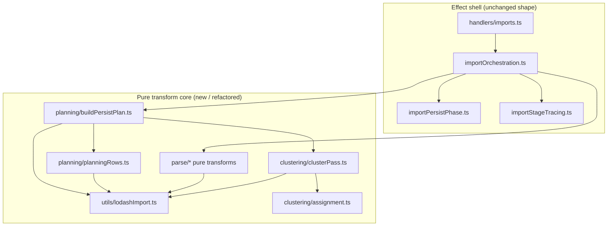
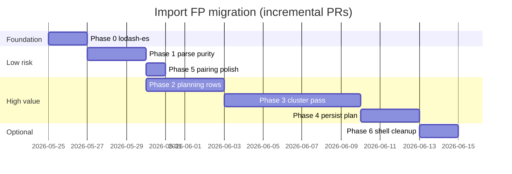

# Import pipeline — functional programming migration plan

**Status:** Planned (not yet implemented)  
**Parent design:** [`import_transaction_files.md`](./import_transaction_files.md) §4.1 (pure planning preference), §4.4 (bounded purity), §4.5 (adoption phases)  
**Scope:** `backend/src/services/import/` (~3.5k lines) and `backend/src/services/pairing/ingest.ts` (stage **7**)  
**Utility library:** [`lodash-es`](https://lodash.com/docs) (tree-shakeable ESM; **named imports only**)

---

## 1. Purpose

Migrate the import **planning** path toward **functional, composable pure transforms** so the code is easier to reason about, test, and reuse. The primary goal is **cognitive load reduction**, not a large reduction in line count.

This document is the **actionable roadmap** for that refactor. It extends §4.5 in [`import_transaction_files.md`](./import_transaction_files.md).

### 1.1 Goals

| Goal | Meaning |
| ---- | ------- |
| **Pure planning core** | Stages **3–4** (parse/canonical) and **6–9** (snapshot → plan) are deterministic given explicit inputs |
| **Standard data patterns** | Prefer **lodash-es** collection utilities and **`flow`** composition over hand-rolled loops and index cursors |
| **Minimal business surface** | Public pure modules export **named domain transforms** (`withCanonicalAmounts`, `assignClusterLabels`); lodash stays at call sites or in thin orchestration helpers |
| **Thin effect shell** | I/O, locks, tracing, persistence stay in orchestration modules unchanged in *shape* |
| **Incremental delivery** | Each phase is one behaviour-neutral PR; existing integration tests stay green |

### 1.2 Non-goals

- Adopting **fp-ts**, **Effect**, **Ramda**, or a pipeline DSL (defer per §4.5 step 5)
- Rewriting **DBSCAN**, embedder lifecycle, blob storage, or persist choreography
- Composing **orchestration** (`importOrchestration.ts`) into a functional pipeline — tracing and rollback resist clean composition
- Optimising for **LOC reduction** (realistic net change: **~4–8%** fewer lines; complexity drops more than size)
- Importing all of lodash — **named imports only**; curated re-export module documents the surface (§3.3)

---

## 2. Current state (assessment summary)

The import tree is already **partly functional** after the [folder reorganisation](../01_discovery/linear/import_services_folder_reorganisation.md):

| Layer | Path | FP fit today |
| ----- | ---- | ------------ |
| Parse | `parse/` | Mostly pure; one in-place mutator (`applyImportAmountNegation`); manual CSV loop |
| Planning | `runImportPlanning.ts`, `planning/` | Read-once `LedgerSnapshot`; `PersistPlan` artefact — good boundary |
| Clustering | `clustering/clusterPipeline.ts` (521 lines) | **Main complexity hotspot** — parallel arrays, manual `Map` groupBy, index cursor merge |
| Orchestration | `importOrchestration.ts`, `importOrchestrationSteps.ts` | Sequential, traced, effectful — keep as-is |
| Persist / blob | `importPersistPhase.ts`, `blob/` | I/O — out of scope |

**Root cause of cognitive load:** index alignment across `parsed[i]` ↔ `newTransactionIds[i]` ↔ `assignments[i]` ↔ `sources[i]`, plus partition/re-merge for paired transfer legs (stage **7** exclusion).

---

## 3. Target architecture

### 3.1 Effect shell vs pure core



**Rule:** modules in the pure core must **not** import `FinanceRepository`, HTTP handlers, loggers, or tracers. They take data in and return data out.

**Public surface:** orchestration files export stage entry points; pure modules export **narrow domain transforms** — not end-to-end business workflows.

### 3.2 Coding conventions

| Rule | Rationale |
| ---- | --------- |
| **`A → A` or `(A, ctx) → A`** for row batches | Matches §4.1 “list in, map through composed transforms” |
| **No in-place mutation** in planning/parse | §4.4 Q4; use `map` / `flow` returning new arrays and objects |
| **One function = one transform** | Name describes the data change, not the §4.2 stage number |
| **Index alignment via typed rows** | §4.4 — replace parallel arrays with `PlanningRow`; align with **`zipWith`** |
| **lodash-es via curated re-exports** | Single module `utils/lodashImport.ts` lists every lodash API used by import — easy to grep and review |
| **Named imports only** | `import { groupBy, flow } from 'lodash-es'` — never `import _ from 'lodash-es'` |
| **`flow` for linear pure chains** | Replaces nested calls and manual pipeline locals where steps are unary |
| **Embedder / repo at shell boundary** | §4.7 Q3 — pure core receives `MerchantEmbedder`, never constructs it |

### 3.3 Lodash adoption

**Package:** add **`lodash-es`** to `backend/package.json` (ESM-native; tree-shakeable with esbuild Lambda bundle).

**Curated re-export:** `backend/src/services/import/utils/lodashImport.ts`

- Re-exports every lodash function the import tree uses (see catalogue below).
- Documents the **allowed** lodash surface for this package in one file.
- May add **one or two** thin wrappers when lodash defaults are wrong for import semantics (e.g. strict length zip — see below).

**Import style at call sites:**

```typescript
import { groupBy, zipWith, flow, compact, partition } from '../utils/lodashImport';
```

**Why lodash (not local helpers or Ramda):**

| Factor | lodash-es |
| ------ | --------- |
| **Recognition** | Team reads `groupBy`, `partition`, `flow` without learning project-specific helpers |
| **Composition** | `flow` / `flowRight` express parse and plan pipelines as named steps |
| **Equality / diff** | `isEqual` replaces hand-rolled embedding and patch comparisons |
| **Set logic** | `difference`, `uniq`, `countBy` replace manual `Set` loops |
| **Debuggability** | Unlike Ramda, lodash functions are not auto-curried — stack traces stay readable |
| **Tree-shaking** | Named imports from `lodash-es`; esbuild already bundles Lambda |

**Explicitly avoided:** **Ramda**, **fp-ts**, **Effect** (see §1.2).

#### Lodash function catalogue (by migration phase)

Use lodash **where it replaces a loop or encodes intent in one name**. Native `map` / spread remain fine when already clear.

| lodash API | Role in import | Phase | Replaces |
| ---------- | -------------- | ----- | -------- |
| **`flow`** | Left-to-right composition of unary pure steps | 1, 3, 4 | Nested locals in `parseCsv`, cluster pass assembly, `buildPersistPlan` |
| **`flowRight`** | Data-last pipelines (optional) | 3 | Alternative when steps read better right-to-left |
| **`groupBy`** | Index → physical cluster label | 3 | Manual `Map` loop in `runClusterPipelineCore` |
| **`mapValues`** | Per-group categorize + hint maps | 3 | `for (const [L, indices] of byLabel)` |
| **`countBy`** | Plurality category among existing rows | 3 | `inheritedCategoryForGroup` `Map` + sort |
| **`maxBy`** | Pick winning category after `countBy` | 3 | Manual sort of `[category, count]` entries |
| **`sortBy`** | Deterministic existing txn order | 2, 3 | Inline `(a, b) => a.date - b.date \|\| …` |
| **`partition`** | Clusterable vs paired / internal-transfer rows | 2 | `partitionParsedForClustering` + filters |
| **`zipWith`** | Align `PlanningRow` with cluster assignments | 2, 3 | `mergeClusterAssignmentsForPairingSkips` index cursor |
| **`compact`** | Drop failed CSV / null parse results | 1 | `continue` loop + manual push |
| **`reject`** / **`filter`** | Counterpart legs, unchanged patches | 4, 5 | Imperative `continue` / `if (!changed)` |
| **`find`** | First successful format parse attempt | 1 | Cascading `if (csv.length) … else if (ofx)` |
| **`some`** | Interest-based negation hint | 1, 4 | `suggestNegateFromInterest` loop |
| **`every`** | Unanimous prior category check | 3 | `unanimousPriorCategoryForGroup` loop (partial) |
| **`isEqual`** | Skip patch when row unchanged | 4 | `embeddingsNearEqual` + field compares |
| **`pick`** / **`omit`** | Pairing patch delta fields | 4 | Manual spread of changed keys |
| **`difference`** | Retired cluster ids | 3, 4 | `computeRetiredClusterIds` set loop |
| **`uniq`** | Distinct cluster ids in summary | 4 | `new Set(toInsert.map(…)).size` pattern |
| **`keyBy`** | Optional leg-id lookups | 2, 5 | `Object.keys` + manual record building |
| **`flatMap`** | Expand group indices to rows | 3 | Nested index loops where appropriate |
| **`fromPairs`** / **`toPairs`** | Map ↔ object at boundaries | 3 | Interop with `Map` cluster state |
| **`defaults`** | Assignment object shapes | 3 | Repeated field literals in three branches |
| **`identity`** | `flow` placeholder / passthrough | 3 | — |
| **`constant`** | Internal-transfer assignment branch | 3 | Repeated `internalTransferAssignment()` in zip |

**Strict zip wrapper (only local helper if needed):**

lodash **`zip`** pads short arrays with `undefined`. For index-aligned planning rows, prefer **`zipWith`** with an explicit mismatch guard, or a thin `zipStrict` in `lodashImport.ts` that throws when lengths differ — document behaviour in tests.

---

## 4. Where composition helps (and where it does not)

### 4.1 High value — `flow` and collection transforms

**Cluster pipeline (stage 8)** — decompose with **`groupBy`**, **`mapValues`**, **`flow`**:

```
sources → map(cleanText) → embed → labels → groupBy(label)
       → mapValues(categorizeGroup) → map(assignRow)
```

Use **record threading** (`ClusterPass`) between async embed and sync lodash steps.

**Assignment decision** — keep `??` chain or use **`find`** over `[inherited, rule, pending]` predicates for readability.

**CSV parse (stage 3)**:

```typescript
const parseBankCsv = flow(
  (text: string) => parseCsvRecords(text),
  (records) => map(records, (rec) => parseCsvRecord(rec, cols)),
  compact,
);
```

**Amount negation (stage 4)**:

```typescript
const withCanonicalAmounts = (rows, negate) =>
  negate ? map(rows, (r) => ({ ...r, canonical_amount: -r.file_amount })) : rows;
```

**Persist plan (stage 9)**:

```typescript
const patchesForChangedRows = flow(
  (pairs) => zipWith(existing, assignments, (old, a) => ({ old, a })),
  (pairs) => reject(pairs, ({ old, a }) => rowUnchanged(old, a)),
  (pairs) => map(pairs, toPatch),
);
```

Use **`isEqual`** inside `rowUnchanged` for embedding comparison.

### 4.2 Medium value

- **`parseImportBuffer`** — `find(formatAttempts, (a) => a.try().rows.length > 0)`
- **`buildPersistPlan`** — `flow` fan-in: `{ patches, inserts, retired, summary }`
- **Pairing ingest** — `flow` + `reject` + `map` for counterpart legs

### 4.3 Low value — leave imperative

| Module | Why |
| ------ | --- |
| `importOrchestration.ts` | Locks, nested try/catch, tracer context |
| `importPersistPhase.ts` | Fixed-order Dynamo writes, staging promote |
| `blob/*` | S3 / filesystem I/O |
| `dbscanCosine.ts` | Stateful algorithm — correct as-is |
| `merchantsEmbedder.ts` | Model load lifecycle |
| `importStageTracing.ts` | Cross-cutting observability wrapper |

---

## 5. Migration phases

Each phase = **one PR**, behaviour-neutral, CI green. Order matters from phase **2** onward.

### Phase 0 — Foundation: lodash-es

**Deliverables**

| Item | Path | Notes |
| ---- | ---- | ----- |
| Dependency | `backend/package.json` | `"lodash-es": "^4.17.21"` (or current stable) |
| Curated re-exports | `backend/src/services/import/utils/lodashImport.ts` | Re-export catalogue from §3.3; add `zipStrict` if needed |
| Tracer helper (optional) | `backend/src/services/import/utils/traceStage.ts` | Shell-only; dedupes `tracer?.run ?? fn` |
| Smoke test | `backend/test/lodashImport.test.cjs` | Verify `groupBy`, `zipWith`, `flow`, `compact` behave as import expects (esp. strict zip) |

**Done when:** `lodash-es` installed; `lodashImport.ts` re-exports documented set; backend build and tests green; no domain refactors yet.

**Bundle note:** confirm esbuild Lambda script tree-shakes named imports (expected with `lodash-es`).

---

### Phase 1 — Parse layer purity (stages **3–4**)

#### 1a. Canonical rows (stage **4**)

| Extract | lodash / pattern | Replaces |
| ------- | ---------------- | -------- |
| `withCanonicalAmounts` | `map` when negating | mutating `applyImportAmountNegation` |
| `resolveNegationPolicy` | pure; **`some`** in interest hint | inline policy |

**Files:** `parse/canonical.ts`, `parse/amountNegation.ts`, `importOrchestrationSteps.ts`

#### 1b. CSV row pipeline (stage **3**)

| Extract | lodash | Replaces |
| ------- | ------ | -------- |
| `parseCsvRecord` | — (pure domain) | inline validation |
| `parseBankCsv` | **`flow`** + **`map`** + **`compact`** | imperative `for` + `continue` |

**Files:** `parse/parseCsv.ts`

#### 1c. Format detection (stage **3**)

Replace duplicated OFX/QFX branches with **`find`** over a strategy array in `parse/parseImportBuffer.ts`.

**Done when:** no `void` mutators in `parse/canonical.ts`; stage **4** immutability covered by tests.

---

### Phase 2 — Planning row model (stages **5–7** prep)

**New module:** `planning/planningRows.ts`

```typescript
type PlanningRow =
  | { kind: 'existing'; id: string; record: TransactionRecord; clusterable: boolean }
  | { kind: 'new'; id: string; row: ParsedImportRow; clusterable: boolean };
```

| Pure function | lodash | Purpose |
| ------------- | ------ | ------- |
| `buildPlanningRows` | **`sortBy`**, **`partition`**, **`zipWith`** (ids ↔ parsed) | Single ordered list |
| `clusterableRows` | **`filter`** | Stage **8** input |

**Eliminates (in phase 3):** `partitionParsedForClustering`, `sourcesClusterableFromPartition`, `mergeClusterAssignmentsForPairingSkips`.

**Files:** new `planning/planningRows.ts`; wire in `runImportPlanning.ts`.

**Done when:** alignment tests pass; behaviour unchanged under integration tests.

---

### Phase 3 — Cluster pass decomposition (stage **8**) — highest impact

Split `clustering/clusterPipeline.ts` (~521 lines → orchestrator ~200 lines):

| Module | lodash highlights |
| ------ | ----------------- |
| `clustering/clusterPass.ts` | **`flow`** orchestration |
| `clustering/cleanEmbed.ts` | `map` |
| `clustering/labelGroups.ts` | **`groupBy`**, **`fromPairs`** / **`toPairs`** |
| `clustering/assignment.ts` | **`countBy`**, **`maxBy`**, **`defaults`**, **`find`** (decision chain) |
| `clustering/clusterPipeline.ts` | thin public API |

**Replace merge cursor** with:

```typescript
zipWith(planningRows, clusterableAssignments, (row, assign) =>
  row.clusterable ? assign : internalTransferAssignment(),
);
```

**Replace manual group loop** with:

```typescript
const byLabel = groupBy(range(sources.length), (i) => labels[i]);
// or groupBy indexed pairs if label lookup by index
```

**`computeRetiredClusterIds`:**

```typescript
difference(uniq(map(existing, 'cluster_id')), uniq(map(assignments, 'cluster_id')));
```

(filter falsy cluster ids in a small domain wrapper)

**Keep exported for tests:** `splitNoiseLabels`, `unanimousPriorCategoryForGroup`, `computeRetiredClusterIds`, `runClusterAndCategoryPipeline`.

**Done when:** no index cursor; stage **8** unchanged under integration tests.

---

### Phase 4 — Persist plan assembly (stage **9**)

**New module:** `planning/buildPersistPlan.ts`

| Pure function | lodash |
| ------------- | ------ |
| `patchesForChangedRows` | **`zipWith`**, **`reject`**, **`isEqual`**, **`pick`** |
| `insertsFromNewRows` | **`filter`**, **`map`** |
| `summarizeInserts` | **`countBy`**, **`uniq`** |
| `buildPersistPlan` | **`flow`** composing above + **`difference`** for retired ids |

**Target:** `runImportPlanning.ts` ~80 lines — validate → pair → cluster → `buildPersistPlan`.

**Done when:** stage **9** logic lives in one pure module with focused unit tests.

---

### Phase 5 — Pairing polish (stage **7**)

| Change | lodash | File |
| ------ | ------ | ---- |
| Counterpart legs | **`flow`**, **`reject`**, **`map`** | `pairing/ingest.ts` |
| Proposal legs | **`zipWith`** (parsed ↔ ids) | same |

**Done when:** no manual `push` loops in pairing ingest.

---

### Phase 6 — Shell cleanup (optional)

| Item | Benefit |
| ---- | ------- |
| `traceStage` in orchestration + planning | Removes tracer boilerplate |
| Embedder injection at planning boundary | Clearer test seam (§4.7 Q3) |

**Defer:** orchestration **`flow`** DSL until types stabilise (§4.5 step 5).

---

## 6. Rollout timeline



| Phase | Risk | Mitigation |
| ----- | ---- | ---------- |
| 0 | Low | Dependency + re-export only; smoke tests |
| 1 | Low | Immutable rows; orchestration reassigns `parsed.rows` |
| 2 | Medium | Alignment tests; **`zipWith`** / strict zip tested |
| 3 | **Highest** | Keep `physicalGroupLabels` hook; integration tests |
| 4–6 | Low | Logic already covered indirectly |

---

## 7. Testing strategy

| Layer | Approach |
| ----- | -------- |
| **lodash smoke** | `lodashImport.test.cjs` — `groupBy`, `zipWith`, `flow`, strict zip |
| **Pure transforms** | Unit tests with fixtures — no repo, no embedder |
| **Cluster pass** | `physicalGroupLabels` hook; golden tests per step |
| **Integration** | `runImportPlanning.test.cjs`, `importOrchestration.test.cjs` unchanged each phase |
| **Regression** | Same `PersistPlan` for fixed inputs before/after each phase |

**Rule:** every new pure function gets at least one focused test before the old imperative path is deleted.

---

## 8. Expected outcomes

### 8.1 Cognitive (primary)

After phase **4**, a developer should answer without reading 500 lines:

1. **What does stage 8 do?** → Read function names in `clusterPass.ts` and lodash steps in `labelGroups.ts` / `assignment.ts`
2. **Where is pairing exclusion applied?** → `buildPlanningRows` → **`partition`** → `clusterable`
3. **What gets written to Dynamo?** → `buildPersistPlan` output type only
4. **Which lodash APIs does import use?** → Read `utils/lodashImport.ts` (single catalogue)
5. **Can I test categorization without DB?** → Yes — `assignment.ts` + stub embeddings

Estimated **25–35% reduction** in perceived complexity for clustering/planning.

### 8.2 Line count (secondary)

| Scenario | Net Δ | New total (~) |
| -------- | ----- | ------------- |
| Conservative | −80 to −150 | ~3,420–3,490 |
| Realistic | −180 to −280 | ~3,290–3,390 |
| Optimistic | −300 to −380 | ~3,190–3,270 |

lodash removes more loop boilerplate than local helpers would; offset by **`lodashImport.ts`**, domain modules, and file splits (~80–120 lines infrastructure).

---

## 9. Success criteria

- [ ] `lodash-es` in `backend/package.json`; named imports only
- [ ] `utils/lodashImport.ts` documents full lodash surface used by import
- [ ] No in-place mutation of `ParsedImportRow[]` in planning path
- [ ] Stage **8** uses **`groupBy`** / **`zipWith`** — no index cursor
- [ ] Stage **9** uses **`flow`**, **`isEqual`**, **`reject`** for patches and summary
- [ ] `PlanningRow` replaces parallel-array alignment
- [ ] Pure core has zero imports from repository / HTTP / logger
- [ ] All existing import integration tests pass
- [ ] §4.5 in [`import_transaction_files.md`](./import_transaction_files.md) references this doc

---

## 10. Suggested first PR

**Phase 0 + Phase 1a** in one reviewable change:

1. Add **`lodash-es`** to `backend/package.json`
2. Add **`utils/lodashImport.ts`** + smoke tests
3. Add `withCanonicalAmounts` (**`map`**); stop mutating in `applyImportAmountNegation`
4. Use **`some`** in `suggestNegateFromInterest` (optional same PR)
5. Update `applyAmountNegationPolicy` to return new rows

Establishes lodash conventions before touching clustering.

---

## 11. Related documents

| Document | Relationship |
| -------- | ------------ |
| [`import_transaction_files.md`](./import_transaction_files.md) | Authoritative stage model §4.2; pure planning preference §4.1 |
| [`import_observability.md`](./import_observability.md) | Stage tracing unchanged; shell stays imperative |
| [`transaction_analysis_clusters_and_categories.md`](./transaction_analysis_clusters_and_categories.md) | Domain rules for clustering (stage **8**) |
| [`transfer_matching.md`](./transfer_matching.md) | Pairing exclusion (stage **7**) |
| [`../01_discovery/linear/import_services_folder_reorganisation.md`](../01_discovery/linear/import_services_folder_reorganisation.md) | Completed folder layout |
| [`../01_discovery/linear/import_fp_migration.md`](../01_discovery/linear/import_fp_migration.md) | Linear project backlog (HOU-54–HOU-60) |

---

## 12. Maintenance

When implementing a phase:

1. Import lodash only from **`utils/lodashImport.ts`** — add new APIs to the re-export list when needed
2. Match existing patterns in the touched package (`AGENTS.md`)
3. Update the **Implementation pointers** table in [`import_transaction_files.md`](./import_transaction_files.md) if new modules are added
4. Mark phase checkboxes in §9 as complete
5. Do **not** expand scope into persist, blob, or orchestration composition
