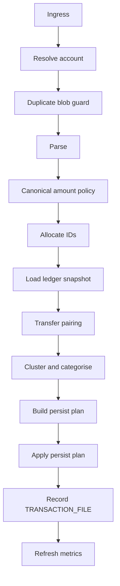
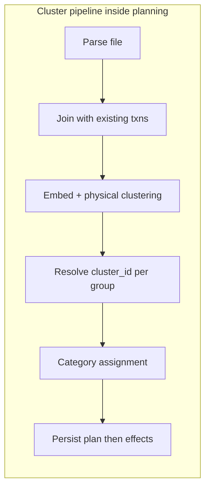
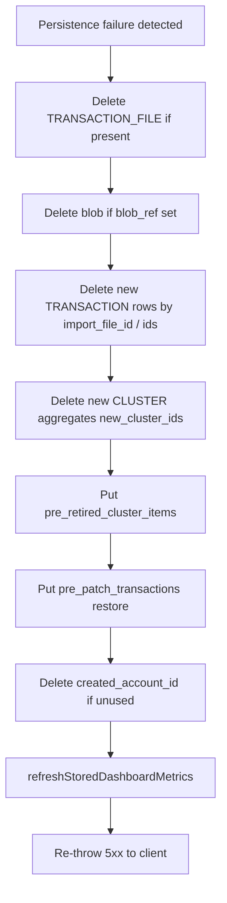
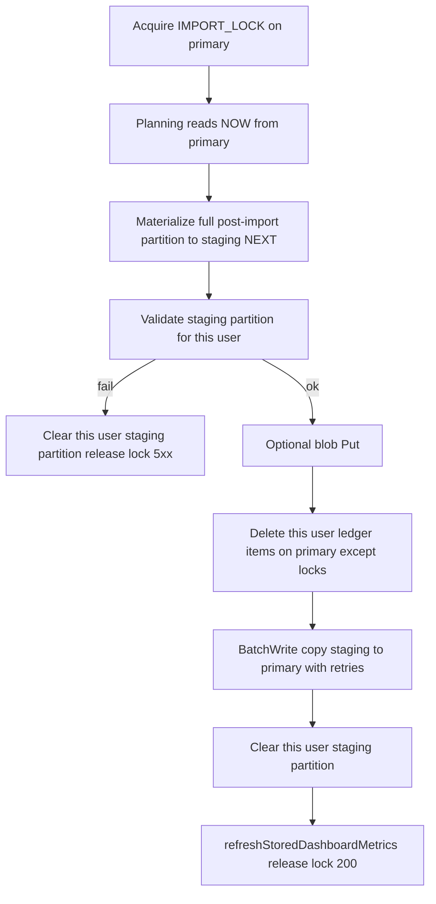

---

## title: Importing transaction files (orchestration, clustering & cluster identity)

stage: Detailed Design
phase: Ingestion

# Importing transaction files (orchestration, clustering & cluster identity)

This document is the **detailed design** for the server-side import pipeline: **explicit orchestration** from HTTP upload through planning and persistence, how **cluster identity** is chosen or revised across imports, and what must be written to the database. It does **not** replace file-to-field rules (`[import_field_mapping.md](./import_field_mapping.md)`), the **HTTP/JSON** contract (`[api_contract.md](./api_contract.md)`), or the **physical** DynamoDB layout (`[database/data_model.md](./database/data_model.md)`); it sits between them and the clustering behaviour already discussed at a high level in `[transaction_analysis_clusters_and_categories.md](./transaction_analysis_clusters_and_categories.md)`. **Internal transfer pairing** (`pairing_id`) and exclusion from clustering are specified in `[transfer_matching.md](./transfer_matching.md)`.

**Raw upload bytes:** Today only metadata is stored on each `TRANSACTION_FILE`; persisting the original file to disk (local dev) or S3 (prod) is specified in `[import_file_blob_storage.md](./import_file_blob_storage.md)`.

**Implementation pointers:**

| Layer | Path | §4.2 role |
| ----- | ---- | --------- |
| HTTP handler | `backend/src/handlers/imports.ts` | Stage **1** ingress (`extractImportMultipart`) + delegate |
| Orchestration (root) | `backend/src/services/import/importOrchestration.ts`, `importOrchestrationSteps.ts` | Ordered stages **2–12** |
| Planning (root) | `backend/src/services/import/runImportPlanning.ts` | Stages **7–9** |
| Persistence (root) | `backend/src/services/import/importPersistPhase.ts` | Stage **10** (staging promote or in-place) |
| Observability (root) | `backend/src/services/import/importStageTracing.ts` | Per-stage tracing ([`import_observability.md`](./import_observability.md)) |
| Ingress | `backend/src/services/import/ingress/multipartFile.ts` | Stage **1** extract |
| Parse | `backend/src/services/import/parse/` (`parseImportBuffer`, `amountNegation`, `canonical`, …) | Stages **3–4** |
| Planning helpers | `backend/src/services/import/planning/` (`allocateBatchIds`, `ledgerSnapshot`, `persistPlan`) | Stages **5–6**, **9** |
| Clustering | `backend/src/services/import/clustering/` (`clusterPipeline`, `clusterIdentity`, …) | Stage **8** |
| Blob storage | `backend/src/services/import/blob/` (`blobFingerprint`, `importBlobPersist`, …) | Stage **2b** fingerprint; post-promote blob `Put` |
| Transfer pairing | `backend/src/services/pairing/` | Stage **7** |

**Status:** Orchestration modularity is a **target shape**; behaviour may still be bundled in fewer modules. Cluster rules below specify **intended** behaviour, including product decisions not yet fully implemented.

---

## 1. Goals

- **Clarity:** Anyone extending imports, review, or tag rules can see how `cluster_id` is **minted** each corpus re-cluster (**§6.0**), how **split** / **merge** reshape groups, and (optionally) how a **planning-time** notion of `**prior_cluster_ids`** assists reasoning or logs—**without** requiring it on `**CLUSTER#…`** (**§11.1**)—and that ids are never left **unset** persistently (**§6.5**, legacy permitting).
- **User trust:** Re-cluster runs **remint** transactional ids across all groups (**§6.0**) in a predictable way; trust comes from **transactions + import history + observability**, not from persisting prior-id lineage on aggregates (**§11.1**).
- **Honesty on change:** Corpus re-clustering **remints** transactional ids (**§6.0**)**. Retire orphaned `CLUSTER#…` projections and expect tag/review artefacts to invalidate when clustering reshapes groups (**§7–§8**).
- **Durability:** **Every** transactional `**cluster_id`** assignment produced by corpus re-clustering is **persisted** on the **transaction** item in DynamoDB, with **GSI1** and `**CLUSTER#…`** items updated consistently for **live** ids—**no obligation** to persist `**prior_cluster_ids`** on `**CLUSTER#…`** (**§11.1**).
- **Observable orchestration:** Engineers can follow one ordered flow (§4) from multipart ingress through `**PersistPlan`** and fixed-order writes, with known coupling points called out.
- **Pure planning by default:** Prefer **functional, low-mutation** transformations within planning (§4.1)—see exceptions in §4.4.

### 1.1 Product role of `cluster_id` (workflow vs reporting)

- **On transactions:** `cluster_id` remains **stored per transaction** so **categorisation workflows** (and related server paths: GSI1, `CLUSTER#…` rows) can **group** rows and let the user work through many similar merchants quickly. The embedding run and **re-clustering** may be repeated whenever useful; ids may **split**, **merge**, or be **re-minted** without implying a long-lived business dimension.
- **Not for financial metrics:** **Dashboard / `METRICS`** and other **reporting** surfaces should **not** key off `**cluster_id`** — use **category**, amounts, dates, accounts, and other fields users care about in statements. Today’s stored dashboard shape is built from transactions in `db/src/dashboardMetrics.ts` using **category** (and amounts/dates), not cluster; keep it that way unless the product explicitly adds a separate “cluster analytics” feature.

---

## 2. Scope

| In scope                                                                                                            | Out of scope (see other docs or future work)                              |
| ------------------------------------------------------------------------------------------------------------------- | ------------------------------------------------------------------------- |
| **End-to-end import orchestration** (plan vs persist), transfer pairing during ingest, multi-file cluster lifecycle | Exact embedding model, `DBSCAN` hyperparameters, or ML notebook workflows |
| Rules for **split**, **merge**, and **full transactional remint** on corpus re-cluster (**§6.0**)                   | CSV/OFX column mapping (see `import_field_mapping.md`)                    |
| DB write requirements for transactions and cluster aggregates                                                       | Frontend UX copy and API pagination details not tied to import            |

---

## 3. Terminology

| Term                                            | Meaning                                                                                                                                                                                                                                                                                                                                                                                                                                                                                                                                              |
| ----------------------------------------------- | ---------------------------------------------------------------------------------------------------------------------------------------------------------------------------------------------------------------------------------------------------------------------------------------------------------------------------------------------------------------------------------------------------------------------------------------------------------------------------------------------------------------------------------------------------- |
| **Parsed row**                                  | Normalized line from a file (`date`, `amount`, `raw_merchant`, …) before persistence.                                                                                                                                                                                                                                                                                                                                                                                                                                                                |
| **Source row (pipeline)**                       | Either an **existing** `TransactionRecord` from the store or a **new** parsed row to be inserted.                                                                                                                                                                                                                                                                                                                                                                                                                                                    |
| **Physical cluster (embedding group)**          | A set of source rows that receive the **same** label from the embedding step and density clustering (e.g. DBSCAN on cosine distance). The algorithm groups **indices**, not old ids.                                                                                                                                                                                                                                                                                                                                                                 |
| `**cluster_id` (logical)**                      | Opaque **non-empty** string on each persisted transaction participating in clustering (recommended form: prefixed random id, e.g. `CL_` + UUID). Used on `CLUSTER#<cluster_id>` items and `**GSI1PK`**. Persisted `**cluster_id`** is **never** deliberately `null` or absent solely because automatic grouping failed; **noise / singletons / low-density** groups still **mint** a new id so categorisation workflows and aggregates have a stable handle. Legacy rows missing `cluster_id` may remain until migrated on read or next full ingest. |
| `**prior_cluster_ids` (planning / diagnostic)** | **Optional** distinct sorted list of transactional `**cluster_id`s** borne by **existing** members **before** reassignment in a physical group (**§6.0**, **§6.1**). **Use for in-run logic, tests, or structured logs—not a persistence requirement** on `**CLUSTER#…`** (**§11.1**). Empty when the group is **new-import-only**.                                                                                                                                                                                                                  |
| **Conservation**                                | ~~A policy outcome~~ **Superseded** by **§6.0.** Prior design: new physical groups could **carry** a single legacy `cluster_id`. Current design **always mints** transactional ids per group on corpus re-cluster (**no carry**)**.                                                                                                                                                                                                                                                                                                                  |
| **Split**                                       | One prior `cluster_id` (or a single historical grouping) is represented in **more than one** new physical group after re-clustering.                                                                                                                                                                                                                                                                                                                                                                                                                 |
| **Merge**                                       | One new physical group contains **more than one** distinct prior non-null `cluster_id` among **existing** transactions.                                                                                                                                                                                                                                                                                                                                                                                                                              |
| **Retire (a cluster id)**                       | No transaction points to that `cluster_id` after commit; the `**CLUSTER#…`** item is obsolete for live rules and can be pruned or tombstoned per ops policy.                                                                                                                                                                                                                                                                                                                                                                                         |
| `**LedgerSnapshot`**                            | Read-once view of existing transactions + file→account map for pairing and clustering (orchestration §4.2 stage 6).                                                                                                                                                                                                                                                                                                                                                                                                                                  |
| `**PersistPlan`**                               | In-memory outcome of planning: `to_insert[]`, `existing_patches[]`, `retired_cluster_ids[]`, summary—before Dynamo writes.                                                                                                                                                                                                                                                                                                                                                                                                                           |
| `**ImportRollbackManifest`**                    | Pre-persistence snapshots captured at end of planning (§8.6): enough to **compensate** a failed in-place import by restoring DynamoDB (and optional blob) to the pre-run ledger state. **Alternative** to **§8.7** staging.                                                                                                                                                                                                                                                                                                                          |
| **Now (ledger)**                                | The **committed** user partition on the **primary** DynamoDB table — what read APIs serve before a successful import promote.                                                                                                                                                                                                                                                                                                                                                                                                                        |
| **Next (ledger)**                               | The **materialized post-import** user partition written to the **import staging** table during persistence (**§8.7**); promoted to **now** on success.                                                                                                                                                                                                                                                                                                                                                                                               |
| `**IMPORT_LOCK`**                               | Primary-table single-flight row (`SYSTEM#IMPORT_LOCK`, **§8.7**) while an import is in flight for that user.                                                                                                                                                                                                                                                                                                                                                                                                                                         |

---

## 4. End-to-end orchestration (HTTP import)

The handler should remain **thin**: it delegates to a **top-level module** under `backend/src/services/import` (e.g. `importOrchestration.ts`), with **one submodule per numbered stage** where practical.

### 4.1 Orchestration goals

- **Observable order:** One module lists stages **exactly** as executed.
- **Typed boundaries:** Prefer **planning** (no Dynamo writes except reads) vs **persistence** (fixed write order).
- **Honest coupling:** Not every stage is an independent DAG node—some orderings are **mandatory** (§4.5).
- **List in, map through composed transforms:** Where a stage’s job is shaping **many rows**, prefer `**rows → rows`** flows: thread the incoming **array** through `**map` (or equivalent fold/zip where alignment matters)** applied to **small pure functions**, **composed** from left-to-right (`f ∘ g ∘ …`) so each function has a **single, obvious transformation goal**. Avoid oversized “kitchen sink” loops; cross-row logic (sorted merge, clustering) stays in **named orchestration wrappers** around those pieces.
- **Pure where possible, FP-leaning:** Planning steps (especially **6–9**) should be **as pure as practical**—**deterministic outputs from explicit inputs**, **avoid in-place mutation**, prefer **composition** and small functions over shared mutable state—so behaviour is **easy to test** and **safe to refactor**. Push **side effects** (HTTP, DB, heavy model load) to **thin edges** (ingress, repository calls, `**persistImportPlan`**, embedder construction). Streaming or async generators remain compatible with this style when row counts grow (see §4.7 Q4).

### 4.2 Stage model

| #   | Stage                           | Responsibility                                                                                                                                                                                                              | Typical output / artefact                                                                                                                               |
| --- | ------------------------------- | --------------------------------------------------------------------------------------------------------------------------------------------------------------------------------------------------------------------------- | ------------------------------------------------------------------------------------------------------------------------------------------------------- |
| 1   | **Ingress**                     | Multipart extraction, validation, size limits (`extractImportMultipart`).                                                                                                                                                   | `file` buffer + form fields (`negate_amounts`, account selectors).                                                                                      |
| 2   | **Resolve account**             | Create new account or validate existing (`FinanceRepository`).                                                                                                                                                              | `account_id` for this import batch.                                                                                                                     |
| 2b  | **Duplicate blob guard**        | Cryptographic fingerprint of the **raw multipart `file` bytes** (see **§11.2.1**). If this user already has a completed `**TRANSACTION_FILE`** with the same fingerprint, **abort before parse/ingest**.                    | `**409 Conflict`** JSON (**camelCase**) per **§11.2.1** — includes `**existingImportFileId`**, `**priorImportFileName`**, `**priorImportCompletedAt**`. |
| 3   | **Parse**                       | Detect format and decode rows (`parseImportBuffer`).                                                                                                                                                                        | `ParsedImportRow[]`, `detectedFormat`, optional `**import_currency`** hint.                                                                             |
| 4   | **Canonical amount policy**     | Resolve negate flag from explicit field + hints; apply canonical sign convention (`resolveAmountNegation`, `applyImportAmountNegation`).                                                                                    | Canonical amounts per `[import_field_mapping.md](./import_field_mapping.md)`.                                                                           |
| 5   | **Allocate batch artefact IDs** | `**import_file_id`** for the `TRANSACTION_FILE` / `FILE#…` row and **per-row `transaction_id`s** (mint txn ids early; **retain** `import_file_id`—required for `**transaction_file_id`** on each transaction and **GSI2**). | `import_file_id`, `transaction_id[]`.                                                                                                                   |
| 6   | **Load ledger snapshot**        | `listTransactions`, `listTransactionFiles` → **file→account** map.                                                                                                                                                          | `**LedgerSnapshot`** (read-only for planning).                                                                                                          |
| 7   | **Transfer pairing**            | Ingest-scoped pairing (`[transfer_matching.md](./transfer_matching.md)`); build `**paired_txn_ids`** for clustering exclusion (**§7** there).                                                                               | `**pairing_by_leg_id`**, `**paired_txn_ids`** (include existing rows that already persist `**pairing_id**`). Code: `backend/src/services/pairing/`.     |
| 8   | **Cluster & categorise**        | Embeddings, physical grouping (`DBSCAN`-style), cluster **identity**, rule/ML categorisation (`runClusterAndCategoryPipeline`). Paired legs skip merchant clustering.                                                       | Per-row `**Assignment`**; alignment with `sources` / `existingSorted`.                                                                                  |
| 9   | **Build persist intents**       | Assemble `**ImportTransactionInput`** and `**ExistingTransactionPatch`**; derive `**retired_cluster_ids`**.                                                                                                                 | `**PersistPlan**`.                                                                                                                                      |
| 10  | **Apply persist plan**          | **Preferred (§8.7):** materialize full post-import partition to **import staging** → validate → promote (delete **this user's** primary partition → copy staging → primary). **Legacy / fallback (§8.6):** in-place patch → ingest → retire on primary with compensating rollback. | Committed txn + cluster state on **primary**.                                                                                                           |
| 11  | **Record import file metadata** | `recordTransactionFile` (timing, format, result envelope, **blob fingerprint** per **§11.2.1**).                                                                                                                            | `TRANSACTION_FILE` per `[database/data_model.md](./database/data_model.md)`.                                                                            |
| 12  | **Derive aggregates**           | `refreshStoredDashboardMetrics` (may be **async** if UI shows **last-updated** on metrics).                                                                                                                                 | `METRICS` snapshot.                                                                                                                                     |

**Relation to §5:** Stages **7–8** are the **pairing + cluster pipeline**; §5 zooms into the **clustering / identity** substeps inside stage 8 and ties them to [§6](#6-cluster-identity-resolution).

### 4.3 Planning vs persistence

| Layer           | Stages                                                                                                                                        | Dynamo writes                             |
| --------------- | --------------------------------------------------------------------------------------------------------------------------------------------- | ----------------------------------------- |
| **Planning**    | **2b** (duplicate blob guard — `**TRANSACTION_FILE` read only**, §11.2.1), 6–9 (aread ledger once; pairing; cluster; build `**PersistPlan`**) | Reads only (plus embedder init inside 8). |
| **Persistence** | 10–12                                                                                                                                         | Yes — **§8.7** staging + promote (preferred) or **§8.6** in-place + compensate. |

Target API shape: `**runImportPlanning(…): PersistPlan`** then `**persistImportPlan(repo, plan, …)`** for testability.

### 4.4 Stages that resist easy modularisation

The following are coupling or legacy patterns; they do **not** invalidate the **pure planning** preference in §4.1—they are where purity is **bounded** or phased in.

- **Canonical row mutation:** `applyImportAmountNegation` may mutate `ParsedImportRow[]` in place today; prefer **pure** outputs when refactored (§4.7 Q4).
- **Merchant embedder lifecycle:** Pass **one** `MerchantEmbedder` per request (DI: real in Lambda, stub in unit tests—§4.7 Q3).
- **Single ledger snapshot:** Do not re-`listTransactions` per sub-stage; thread `**LedgerSnapshot`**.
- **Dynamo write choreography:** `patchExistingTransactionsAfterImport` → `ingestImportBatch` → `retireClusterAggregates` (then file row) is one **subroutine**—see also [§8.1](#81-transactions).
- **Index alignment:** `ParsedImportRow[i]` ↔ `newTransactionIds[i]` ↔ assignments; preserve or replace with keyed structures explicitly.

### 4.5 Adoption phases (refactor roadmap)

**Completed (baseline for FP migration):**

1. Extract `**PersistPlan`** + `**persistImportPlan`** from the handler.
2. Extract `**LedgerSnapshot`** builder (read-once).
3. Unify **ID allocation** after parse (txn ids + `import_file_id` co-located).
4. Replace `**enrichImportRows`** with `**runImportPlanning`** (stages 7–9) or keep as thin wrapper.

**Next — pure planning / FP migration** (phased, behaviour-neutral PRs): see [`import_fp_migration.md`](./import_fp_migration.md).

5. **Phase 0–1:** adopt **`lodash-es`** (curated re-exports in `utils/lodashImport.ts`); immutable parse / canonical amount transforms (stages **3–4**).
6. **Phase 2:** `PlanningRow` model — replace parallel-array index alignment with **`partition`** / **`zipWith`** (§4.4).
7. **Phase 3–4:** decompose cluster pass (stage **8**) with **`groupBy`**, **`mapValues`**, **`flow`**; `buildPersistPlan` (stage **9**) with **`isEqual`**, **`reject`**, **`countBy`**.
8. **Phase 5–6:** pairing polish; optional tracer helper — **defer orchestration pipeline DSL** until types stabilise.

### 4.6 Design questions and answers

**Q1 — Where does orchestration live?**  
**A1** — HTTP handler delegates to `**backend/src/services/import`** top-level orchestration; **each stage** gets its own submodule where practical.

**Q2 — Error boundaries?**  
**A2** — **Clear 5xx**; no ambiguous partial success. **Integrity first**; bounded retries only where consistent—document in `[api_contract.md](./api_contract.md)`. **Preferred:** persist via **now / next staging** (**§8.7**) so **primary stays untouched** until promote; abort clears **only that user's staging partition**. **Fallback:** in-place writes on primary require **compensating rollback** (**§8.6**). Neither path returns **`200`** unless the import is fully committed on primary.

**Q3 — Embedder in tests?**  
**A3** — **Inject `MerchantEmbedder`**: production uses `createMerchantEmbedder()`; unit tests use a **fixed-dimension stub** or fixture replay; optional rare **golden** integration with Transformers.

**Q4 — Immutability of parsed rows?**  
**A4** — Prefer **pure** stages or streaming/generators for large files; compatible with read-once `**LedgerSnapshot`** until chunking.

**Q5 — Multi-currency?**  
**A5** — **Single account currency** for now; use file/account-level currency for pairing rollups; align with **HOU-33** (currency + amounts design).

**Q6 — Metrics refresh?**  
**A6** — **Async OK** if dashboard shows **last-updated** / staleness from `**METRICS`** metadata.

**Q7 — `import_file_id` vs txn ids?**  
**A7** — **Mint txn ids early** after parse. `**import_file_id` / `TRANSACTION_FILE` remains required** for provenance, `**transaction_file_id`**, and **GSI2**—not removable without a schema migration.

**Q8 — Non-import pairing / reconciliation?**  
**A8** — Keep `**PersistPlan` import-shaped** initially; later **entry-point** into the same ordered pipeline (“start at pairing”) so downstream steps stay consistent.

**Q9 — Dry-run API?**  
**A9** — **Defer.**

### 4.7 Answer review (coherence)

| Topic   | Note                                                                         |
| ------- | ---------------------------------------------------------------------------- |
| A1 + A8 | Orchestration module + future **resume-from-step** share one ordering story. |
| A2      | Map to explicit failure in code; document any retry exceptions.              |
| A7      | Early txn ids ✓; **file/batch id retained** per data model.                  |

### 4.8 Follow-up questions

- **Idempotent import:** Same file twice—dedupe (hash / idempotency key), double persist, or UI-only warning?
- **Concurrent imports (same user):** Serialize, optimistic concurrency, or MVP single-flight?
- **Per-stage observability:** CloudWatch stage duration + `import_file_id` correlation?
- **Row-count ceiling:** When does **SQS/worker** replace single-Lambda planning?
- **Restore lock:** Import vs `[database/data_model.md](./database/data_model.md)` restore / staging behaviour.
- **Raw blob timing:** `[import_file_blob_storage.md](./import_file_blob_storage.md)`—write blob **after** staging validates / before or after promote per **§8.7**; **delete on abort** (staging cleared) or **§8.6** compensate.
- **Persistence strategy:** **§8.7** now/next staging table vs **§8.6** in-place saga — see **§11.2** item **6**.

---

## 5. Cluster pipeline (join, embed, resolve, categorise)

Imports are not “append-only clustering on new file rows.” During **orchestration stage 8**, the implementation joins **all** existing user transactions (or a defined subset if later optimized) with **new** file rows in deterministic order, then runs embedding and identity resolution.

1. **Parse** the upload into canonical rows (upstream of stage 8; see `[import_field_mapping.md](./import_field_mapping.md)`).
2. **Join** with existing stored transactions in a deterministic order (e.g. by date, then id).
3. **Normalize** merchant text for embedding; **compute** embeddings (same model as product policy).
4. **Cluster in embedding space** (e.g. DBSCAN + singleton handling) to produce **physical groups** of indices.
5. `**Resolve`** `cluster_id` for each physical group per [§6.0](#60-full-regeneration-on-corpus-re-cluster): **mint a new transactional id**; singleton/noise semantics in **§6.5**.
6. **Assign category** per group and per product rules (inheritance from existing `CLASSIFIED` rows, rules, ML, review) with explicit handling when [§6](#6-cluster-identity-resolution) forces **new** clusters and thus **new** category expectations (see [§7](#7-category-and-new-clusters)).
7. **Contribute to `PersistPlan`**—patches and new row puts are applied in **orchestration stage 10** ([§8](#8-persistence-and-write-back)), and **import file** metadata is recorded in **stage 11** ([§8.5](#85-import-file-history-file--transaction_file)).

---

## 6. Cluster identity resolution

This section is the **authoritative** ruleset. Implementation may batch steps for performance; behaviour must be equivalent.

### 6.0 Full regeneration on corpus re-cluster

Whenever the joined corpus (existing + new transactions) completes **embedding and physical clustering** in **orchestration stage 8** (a corpus re-cluster), transactional cluster identifiers **must remint:** the server **never copies** yesterday’s transactional `cluster_id` onto members simply because the embedding run ended up cohesive. Instead, **each physical embedding group**:

1. **Mints exactly one fresh `cluster_id`** for **every** member (**existing** patches plus **new** inserts), including singleton/noise/low-density tails, following **§6.5–§6.6.**
2. **Optional `prior_cluster_ids` (planning only):** immediately **before** reassigning transactional ids, implementations **may** compute `**prior_cluster_ids`**—the distinct sorted set of stored non-null `cluster_id` values from existing members in that group (pre-run)—for tests, assertions, structured logs, or in-memory planning. §11.1: this is not a schema or persistence requirement on `**CLUSTER#…`** or **[database/data_model.md](./database/data_model.md)**.
3. Purely **new-import** postings (never stored before this run) contribute **nothing** to `**prior_cluster_ids`** when computed (conceptually empty).
4. **Retirement** (**§8.4**): once transactions repoint to new ids, prior aggregates prune per policy. Auditing relies on **transactions**, `**TRANSACTION_FILE`**, backups, and logs—not on persisting `**prior_cluster_ids`** on `**CLUSTER#…**`.

Splits (**§6.3**) and merges (**§6.4**) remain useful names for reshuffles embeddings produce.** **Cardinality** (**many singletons**) is purely an embeddings/DBSCAN tuning question—never a reason to resurrect **carry**.

### 6.1 Inputs per physical group

- When useful, build `**prior_cluster_ids`** as in **§6.0** bullet **2** (pre-run membership only). **Do not persist** (**§11.1**).
- Groups whose members are exclusively **never-before-seen** imports ⇒ `**prior_cluster_ids` = []** when the optional list is materialized.

### 6.2 Conservation (carry the old id) — superseded

Earlier drafts reused a singleton `**previous_ids`** marker without minting.** **§6.0** rotates **every** transactional id once per corpus re-cluster; **no carry** of prior transactional ids across runs.

### 6.3 Splits

Historical id `**C`** scatters across **multiple** embedding groups.** Each subgroup mints its own transactional id.** Optionally, `**prior_cluster_ids`** (**§6.0**, bullet **2**) reflects each subgroup’s **existing** members (often `**C` alone**) before reassignment—for diagnostics only (**§11.1**).

### 6.4 Merges

Multiple legacy transactional ids coexist in **one embedding group.** When `**prior_cluster_ids`** is materialized (**§6.1**), **it** conceptually unions them (**distinct**, **sorted**) before minting the single replacement transactional id; persistence is **not** required (**§11.1**).

### 6.5 Singleton, noise, “defer” (**still mint; no transactional `null` intent**)

Persist a **fresh** transactional id per noisy/singleton/low-sample bucket **every run** (**§6.0**) so review tooling references real ids.**

Backfill historically missing transactional ids (**[database/data_model.md](./database/data_model.md)**) **before** corpus re-clustering **assigns** `**cluster_id`** values.

### 6.6 Minting cluster ids

Use an opaque `**CL_<uuid>**` (**recommended**) with uniqueness scoped per ingest batch/user.** Ids persist **until another corpus pass** invokes minting (**§6.0**).

---

## 7. Category and “new” clusters

- **Default assignment:** While computing assignments after embeddings and physical grouping (**§6**), **reuse** category from `**CLASSIFIED` / persistently categorized** transactions in the **same post-run resolved group** when lineage is **unambiguous** — same spirit as `**inheritedCategoryForGroup`**-style helpers, adapted to freshly **minted** `cluster_id`s.
- **Review is selective (not blanket):** Corpus re-clustering alone **does not** require every minted `**cluster_id`** to re-enter manual review unless the pipeline’s **chosen category for that aggregate** differs from what members **collectively** had **before this run** (**see below)**.
- `**previous_category_id` (`CLUSTER#…`):** During planning, snapshot **existing** ledger members that **this corpus pass** assigns to **this minted `cluster_id`** (same physical embedding group). If every such member carries the same non-empty transaction `category**` string, persist that consensus on `**CLUSTER#<cluster_id>**` as `previous_category_id`; otherwise `null`. Not transactional `**prior_cluster_ids**` lineage (§11.1**)—those predecessor **cluster** ids remain planning-only (never `**CLUSTER#…`** persistence).
- **When to surface the review queue:** After commit — when `**previous_category_id`** is **non-null** — set `**pending_review`** (**or** equivalent `**GET /api/review-queue` inclusion**) `**true`** if authoritative `**assigned_category**` (`**CLUSTER#**` + propagated transaction `**category**`) `**!==**` `**previous_category_id**`. When `**previous_category_id**` is **`null`** (ambiguous priors, new-only group, or legacy row with attribute absent — treat absent as **`null`**), use the fallback predicate: any member still `**PENDING_REVIEW**` (ambiguous priors often stay `**pending_review`** until inheritance or explicit user assignment).

Splits and merges from [§6](#6-cluster-identity-resolution) reshuffle memberships; homogeneous priors yield a clean non-null `**previous_category_id**` hint while mixed predecessors persist **`null`** and widen review eligibility.

---

## 8. Persistence and write-back

### 8.1 Transactions

- **Every** transaction (**existing or new**) whose transactional `**cluster_id`** is assigned/reassigned by corpus re-clustering must be written on **import commit**.
- **Order:** Define a **safe order** in implementation (e.g. compute full **desired** state in memory, then **patch/put** so no transaction ever references a **retired** `cluster_id` as its current value after the batch completes, except transient failure paths which must be retried or reconciled).
- **Existing transactions** only touched by the pipeline go through the same patch path as today’s `patchExistingTransactionsAfterImport` concept; **new** rows go through the ingest batch.

### 8.2 GSI1 and cluster-backed transactions

- `GSI1` exists so **every live `cluster_id` on a transaction** participates in `**USER#…#CLUSTER#<cluster_id>`** queries (`[database/data_model.md](./database/data_model.md)`)—used for categorisation tooling, `**CLUSTER#…**` consistency, or bulk patches.
- Persisted `**cluster_id**` is **never** `**null`/absent** for **intent** (“leave uncategorized”) under this doc; `**GSI1PK`/`GSI1SK`** accompany that id. Rows **still mid-import** before commit are internal-only.
- `**CLUSTER#…`** projections stay aligned so **GSI1 targets** resolve to upserted **cluster aggregate rows**.
- Legacy items missing `**cluster_id`**: migrate by minting ids and populating **GSI1** (**[database/data_model.md](./database/data_model.md)**)—do not leave half-formed keys indefinitely.

### 8.3 `CLUSTER#…` items

- **Upsert** or **prune** `CLUSTER#…` items so each **live** `cluster_id` has consistent aggregates; prune **retired** ids (**§8.4**).
- `**prior_cluster_ids`** is **not** stored on `**CLUSTER#…`** items (**§11.1**)—optional planning-time list only (**§6.0**).
- `**previous_category_id`** (String or `**null`**, **always persisted** on corpus re-cluster rebuild):** unanimous **prior** transactional `**category`** among **existing** members of this physical embedding group (**§7**) — stored on `**CLUSTER#…`** only (not ephemeral **transaction** id lineage). **Legacy** CLUSTER rows may omit the attribute until the next rebuild; readers treat absent as **`null`** (see **[database/data_model.md](./database/data_model.md)** §2).
- Older **conservation-era** artefacts that kept the **same transactional id** alive across runs **do not** apply under **§6.0**; still avoid duplicate authoritative `**CLUSTER#…`** projections for unrelated ids (**retirement** clears stale aggregates).

### 8.4 Retirement

- **Retire** an old id when no transaction’s **current** `cluster_id` equals that id at end of the batch.
- Optional **background** pass: delete orphan `CLUSTER#` items, or do it in the same import transaction if batching allows.

### 8.5 Import file history (`FILE#…` / `TRANSACTION_FILE`)

- After a **successful** `POST /api/imports` (including zero ingested rows), the server **puts** one `**TRANSACTION_FILE`** item per run. The stored shape is **sectioned** to follow the import run: `**source`** (uploaded file: `name`, `size_bytes`, optional `content_type`), `**format`** (optional `source_format` after sniffing for parse), `**timing`** (`started_at` right after a successful extract, `completed_at` when the run finishes), and `**result`** (full `**ImportIngestResult`**, including `existingTransactionsUpdated` from the re-cluster patch list — see `TransactionFileInput` / `ImportIngestResult` in `db/src/types.ts`). **Payload idempotency:** persist a `**content_sha256`** (lower-case hex SHA-256 of the **exact** multipart `file` bytes) **per §11.2.1** so duplicate uploads can be detected without comparing parsed rows. `GET /api/transaction-files` returns the same structure (`TransactionFileRecord`).
- **Legacy** DynamoDB items may still use the older `file_import` + `ingest` (+ optional `name` / `imported_at` / `row_count`) layout; the repository maps them to the current `**TransactionFileRecord`** shape for the API. Do not expect automated backfills; see the data model.
- These rows are **not** part of the clustering algorithm; they exist so clients can list which files were ingested via `**GET /api/transaction-files`**. See `[database/data_model.md](./database/data_model.md)` §3 and `[api_contract.md](./api_contract.md)`.
- **No migration policy (early):** do not invest in backfills for old `TRANSACTION_FILE` shapes; if items are wrong or pre-date required attributes, **delete them after explicit approval** (or clear non-prod user data) rather than in-place migration—see the **Schema changes / existing data** note in the data model.

### 8.6 Import failure rollback (compensating saga — fallback)

**When to use:** In-place persistence on the **primary** table (today's `patchExistingTransactionsAfterImport` → `ingestImportBatch` → `retireClusterAggregates` path) when an **import staging table** is not configured. **Preferred approach:** **[§8.7](#87-import-staging-now--next-ledger)** — primary stays **now** until promote; no pre-image manifest required for abort-before-promote.

Corpus re-cluster imports are **not append-only**: stage **10** may **patch every existing transaction**, **insert** new rows, and **delete** retired `CLUSTER#…` aggregates. A failure mid-persistence therefore leaves DynamoDB in a **hybrid** state—not fixable by deleting only the new file’s transactions. Rollback must **restore the ledger as it was before stage 10 began**.

#### 8.6.1 Product contract

| Outcome | Client / API |
| -------- | ------------- |
| **Success** | `200` + import summary; `TRANSACTION_FILE` row exists; cluster remint committed (**§11.1** item **3**). |
| **Planning failure** (stages **2–9**) | `4xx` / `5xx`; **no Dynamo writes** from the import batch (except see **§8.6.4** for stage **2** account create). |
| **Persistence failure** (stages **10–12**) | **`5xx`** after **compensating rollback** completes (or **`5xx`** + ops alert if compensation itself fails). **No** `TRANSACTION_FILE` row for this run. Client treats as “clusters unchanged” (**§11.1** item **3**). |

**Integrity first:** Never return **`200`** unless stages **10–11** (and blob when required) have committed. **`METRICS`** refresh (stage **12**) may fail non-fatally only if dashboard staleness is acceptable and a follow-up refresh is scheduled; otherwise include metrics in the rollback boundary.

#### 8.6.2 Why delete-only is insufficient

Stage **10** today (`importOrchestration.ts`) runs, in order:

1. **`patchExistingTransactionsAfterImport`** — overwrites `cluster_id`, category, embeddings, GSI1, pairing fields on **existing** transactions.
2. **`ingestImportBatch`** — puts **new** `TRANSACTION` items (scoped by `transaction_file_id` / **GSI2**) and upserts **`CLUSTER#…`** for clusters touched by **new** rows.
3. **`retireClusterAggregates`** — **deletes** `CLUSTER#…` items whose ids no longer appear on any transaction.

Failure after step **1** or **2** leaves existing rows pointing at **minted** cluster ids while old aggregates may still exist—or, after step **3**, deleted aggregates cannot be recreated without a snapshot. **Deleting new file transactions alone does not revert re-cluster patches.**

#### 8.6.3 `ImportRollbackManifest` (capture at end of planning)

Extend **`PersistPlan`** (stage **9**) with a manifest built from the same **`LedgerSnapshot`** used for planning—**before any stage 10 write**:

| Field | Source | Used to |
| ----- | ------ | ------- |
| `import_file_id` | stage **5** | Delete new txns via **GSI2**; skip if file row never written. |
| `new_transaction_ids[]` | `to_insert[]` | Idempotent delete of inserted rows. |
| `new_cluster_ids[]` | distinct `cluster_id` in `to_insert[]` **and** in `existing_patches[]` (all **minted** this run) | Delete orphan **`CLUSTER#…`** created or overwritten during ingest. |
| `pre_patch_transactions[]` | full **`TransactionRecord`** (or Dynamo item) for each id in `existing_patches[]` | **Put** back prior field values (`cluster_id`, category, status, GSI1, embeddings, pairing, …). |
| `pre_retired_cluster_items[]` | full items for each id in `retired_cluster_ids[]` | **Put** back **`CLUSTER#…`** rows deleted in `retireClusterAggregates`. |
| `created_account_id?` | stage **2** when `createAccount` ran | Delete empty account on rollback (**§8.6.4**). |
| `blob_ref?` | after blob **`Put`** (when enabled) | Compensating **`DeleteObject`** / unlink ([`import_file_blob_storage.md`](./import_file_blob_storage.md) §8). |
| `persist_checkpoint` | enum of last **successful** sub-step | Idempotent retry of compensation after Lambda timeout. |

**Cluster snapshots:** For every id in `retired_cluster_ids[]`, **`BatchGet`** the live `CLUSTER#…` item during planning (same pass as **`LedgerSnapshot`**). Optionally snapshot **`CLUSTER#…`** for ids in `new_cluster_ids[]` that **pre-existed** (merge into an existing aggregate) if ingest overwrites them—today rare under **§6.0** remint but required for correctness if ids collide.

**Metrics:** Do **not** snapshot **`METRICS`**; after successful compensation call **`refreshStoredDashboardMetrics`** (derived from transactions).

#### 8.6.4 Compensation procedure (`compensateFailedImport`)

Run in a **`try/finally`** around stages **10–12** (or dedicated `persistImportPlan` wrapper). On any thrown error after the first persist write, execute **reverse effects** in this order (safe if some steps were never reached—each op is idempotent):

1. **`deleteTransactionFile`** — only if stage **11** completed.
2. **`ImportBlobStore.delete`** — if blob was written ([`import_file_blob_storage.md`](./import_file_blob_storage.md): blob **after** stage **10** success, not before parse).
3. **`deleteTransactionsByImportFileId`** / batch delete by `new_transaction_ids` — removes file-scoped inserts (**GSI2** query + primary keys).
4. **`deleteClusterAggregates(new_cluster_ids)`** — remove minted aggregates; skip ids also listed in `pre_retired_cluster_items` until step **5** restores old rows.
5. **`putClusterItems(pre_retired_cluster_items)`** — restore deleted **`CLUSTER#…`**.
6. **`putTransactions(pre_patch_transactions)`** — full item restore for patched existing rows (not inverse patches—**authoritative pre-image**).
7. **`deleteAccount(created_account_id)`** — only if stage **2** created an account **and** it has no other transactions/files (otherwise leave account; document in ops logs).
8. **`refreshStoredDashboardMetrics`**.

Update **`persist_checkpoint`** after each successful sub-step so a **second** Lambda invocation or retry does not double-delete or skip restore.

#### 8.6.5 Write ordering and checkpoints

The stage **10** order (**patch → ingest → retire**) is retained for referential integrity (**§4.5**, **§8.1**). Rollback does **not** depend on reordering writes; it depends on the **manifest**.

Track checkpoints:

| Checkpoint | After |
| ---------- | ----- |
| `patched_existing` | `patchExistingTransactionsAfterImport` |
| `ingested_new` | `ingestImportBatch` |
| `retired_clusters` | `retireClusterAggregates` |
| `recorded_file` | `recordTransactionFile` |
| `blob_stored` | blob **`Put`** (when enabled) |
| `metrics_refreshed` | `refreshStoredDashboardMetrics` |

Compensation uses the checkpoint to undo **only** what ran. Example: failure during **`ingestImportBatch`** after partial batch write → delete any inserted txns/clusters for this `import_file_id`, then **`putTransactions(pre_patch_transactions)`**.

#### 8.6.6 Concurrency, idempotency, and ops

- **Single-flight per user** (**§11.2** item **1**): required so no concurrent import mutates the ledger while compensation runs.
- **Idempotent compensation:** Safe to run twice (e.g. after timeout); keyed by `import_file_id`.
- **Compensation failure:** Log **`import.compensation_failed`** with manifest + checkpoint; surface **`5xx`**; ops may restore from **`GET /api/backup/export`** snapshot taken before import (manual) or replay compensation.
- **No TransactWriteItems for full batch:** Item counts exceed DynamoDB transaction limits; saga + manifest is the MVP pattern. Optional later: chunk transacts for small imports only.

#### 8.6.7 Implementation targets

| Layer | Responsibility |
| ----- | -------------- |
| Planning (`runImportPlanning`) | Build **`ImportRollbackManifest`** alongside **`PersistPlan`**. |
| `persistImportPlan(repo, plan, manifest, …)` | Checkpoints, **`try/catch`**, invoke **`compensateFailedImport`**. |
| `db/` | `compensateFailedImport`, bulk delete by **GSI2**, full-item **`Put`** restore helpers; optional `deleteAccountIfEmpty`. |
| Blob | **`ImportBlobStore.delete`** on compensation ([`import_file_blob_storage.md`](./import_file_blob_storage.md)). |
| `[api_contract.md](./api_contract.md)` | Document **`5xx`** = no durable import; no partial success body. |

**Target API shape:** `runImportPlanning(…) → { plan: PersistPlan, rollback: ImportRollbackManifest }` then `persistImportPlan(repo, plan, rollback, …)` as in **§4.3**.

### 8.7 Import staging (now / next ledger)

**Decision (persistence):** Corpus re-cluster produces a **full desired ledger** (every transaction, every live `CLUSTER#…`, `FILE#…`, accounts, optional `METRICS`) — not a small delta. Write that outcome to a **dedicated import staging DynamoDB table** (**next**), validate it, then **promote** to **primary** (**now**) by partition-scoped delete + copy. Reuses the same **per-user partition** patterns as backup restore ([`database/data_model.md`](./database/data_model.md) §8.2, `db/src/userPartition.ts`, `db/src/backupRestore.ts`).

#### 8.7.1 Roles

| Slot | Table | Scope | Read APIs |
| ---- | ----- | ----- | --------- |
| **Now** | **Primary** (`DYNAMODB_TABLE_NAME`) | `PK = USER#<user_id>` — committed ledger | All **`GET`** paths until promote completes |
| **Next** | **Import staging** (`DYNAMODB_IMPORT_STAGING_TABLE_NAME`) | **Same** `PK`/`SK`/GSI layout; **only** this user's rows during an in-flight import | Internal / validation only — **not** exposed to clients |

**Concurrent users:** User A's import writes **`PK = USER#A`** on staging; user B's import writes **`PK = USER#B`**. **Abort**, **promote**, and **clear staging** always mean **paginated `Query` + batch delete/copy for that user id only** — never a full-table scan or wipe. Same rule for **primary** deletes during promote: **only** `PK = USER#<user_id>` application items (exclude lock rows — **§8.7.3**).

**Same user:** Overlapping imports remain **blocked** by **`IMPORT_LOCK`** (**§11.2** item **1**) — not by table-level locking.

#### 8.7.2 Workflow

| Step | Action | Primary (now) | Staging (next) |
| ---- | ------ | ------------- | -------------- |
| 0 | **`acquireImportLock`** (orchestration — before writes and corpus reads) | **`IMPORT_LOCK`** row | — |
| 1 | **`runImportPlanning`** (stages **2–9**, incl. optional `createAccount`) | Read only (+ account create when new) | — |
| 2 | **`clearImportStagingPartition(userId)`** | — | Delete all `PK = USER#<uid>` (idempotent) |
| 3 | **`materializeImportPlanToStaging`** | — | **`BatchWriteItem` Put** full post-import item set (transactions with **`GSI1*`/`GSI2*`**, all **`CLUSTER#…`**, new **`FILE#…`**, accounts, `PROFILE`, optional `METRICS`) — same keys they will use on primary |
| 4 | **`validateStagingImportPartition`** | — | Counts, referential integrity, sample **`GSI*`** presence |
| 5 | **Blob `Put`** (when enabled) | — | After validation; see [`import_file_blob_storage.md`](./import_file_blob_storage.md) |
| 6 | **`promoteImportStagingToPrimary`** | Paginated delete ledger SK prefixes for **this user only** (exclude **`SYSTEM#IMPORT_LOCK`**, **`SYSTEM#RESTORE_LOCK`**) | — |
| 7 | **Copy** | **`BatchWriteItem` Put** from staging query (**this user**) | Source of truth until copy verified |
| 8 | **`clearImportStagingPartition(userId)`** | — | Delete **this user's** staging partition |
| 9 | **`refreshStoredDashboardMetrics`**, **`releaseImportLock`**, return **`200`** | Committed **now** | Empty for this user |

**Materialization:** Prefer one pure function **`persistPlanToDynamoItems(plan, ledgerSnapshot, …): Item[]`** over three ordered mutators on primary — easier to test and identical item shapes on staging and primary.

**Zero-row imports:** Still materialize partition state (existing txns after re-cluster, clusters, new empty batch metadata if applicable) when planning touches the corpus; **`200`** + **`TRANSACTION_FILE`** when product requires history for empty files.

#### 8.7.3 `IMPORT_LOCK` (primary only)

Mirror **`RESTORE_LOCK`** ([`database/data_model.md`](./database/data_model.md) §8.2a):

| Key | Value |
| --- | ----- |
| `PK` | `USER#<user_id>` |
| `SK` | **`SYSTEM#IMPORT_LOCK`** (add constant in `db/src/keys.ts`) |

**Attributes (suggested):** `entity_type: IMPORT_LOCK`, `import_file_id`, `import_started_at` (epoch ms). **Do not** replicate lock rows onto staging.

**Mutual exclusion:** **`IMPORT_LOCK`** ⟂ **`RESTORE_LOCK`** ⟂ second import (**`409 Conflict`**). **`POST /api/imports`** while restore lock held → **`409`** (document in [`api_contract.md`](./api_contract.md)).

#### 8.7.4 Abort and failure

| Phase | Primary | Staging | Client |
| ----- | ------- | ------- | ------ |
| Before promote (steps **1–5**) | Unchanged (except lock) | Cleared on abort | **`5xx`** — ledger unchanged |
| Promote: after primary delete, copy incomplete | **Partial** for **this user only** | **Full next retained** | **`5xx`** — retry promote from staging |
| After successful promote | Committed | Cleared for this user | **`200`** |

**Abort (`POST /api/imports/abort` — optional V1):** Same order as restore abort — **`DeleteItem` `IMPORT_LOCK` first**, then **`clearImportStagingPartition(userId)`**. Does not repair a **partial primary** after promote delete; ops / resumable promote playbook (below).

**Copy reliability:** DynamoDB **`BatchWriteItem` Put** with exponential backoff (see `batchWriteItemsParallel` in `backupRestore.ts`) is **very unlikely to fail** at MVP corpus sizes after retries. The meaningful promote risk is **Lambda / HTTP timeout** after primary delete for **this user** — not sustained Dynamo throttling. **Mitigation:** keep **this user's staging partition** until primary copy **and** optional count verification succeed; **`IMPORT_LOCK`** held → **`409`** on new imports; **idempotent retry** of copy from staging.

#### 8.7.5 Comparison with §8.6

| | **§8.7 Staging** | **§8.6 Saga** |
| --- | --- | --- |
| Primary during import | **Read-only** (now) | Mutated in place |
| Failure before commit | Clear **user's** staging | Compensate with manifest |
| Write amplification | ~2× (staging + copy) | ~1× (+ undo cost on failure) |
| Code reuse | `userPartition`, restore copy | New compensate helpers |
| Infra | Second table + env var | Primary only |

#### 8.7.6 Implementation targets

| Layer | Responsibility |
| ----- | -------------- |
| `db/` | `UserPartitionDataset`: add **`import_staging`**; `materializeImportPlanToStaging`, `validateStagingImportPartition`, `promoteImportStagingToPrimary`, `runImportAbortWorkflow`; reuse `batchWriteItemsParallel` / `deleteUserPartition`. |
| `infrastructure/` | **`aws_dynamodb_table.import_staging`** — same schema as primary; name pattern **`…-imports-in-progress`**; Lambda env **`DYNAMODB_IMPORT_STAGING_TABLE_NAME`**. |
| `backend/` | Orchestration stages **10–11** call staging workflow; **`primaryDeleteStarted`** flag like restore. |
| Docs | [`database/data_model.md`](./database/data_model.md) §8.5, [`api_contract.md`](./api_contract.md), [`backend_dev_and_prod_environments.md`](./backend_dev_and_prod_environments.md). |

**Target API shape:** `runImportPlanning(…) → PersistPlan` then `persistImportPlanViaStaging(repo, plan, …)` wrapping **§8.7.2**.

---

## 9. Split / merge detection (implementation note)

To implement [§6.3](#63-splits) and [§6.4](#64-merges) deterministically, one approach (not the only one):

1. After physical clustering, for each old id `**C`** (from any **existing** transaction **before reassignment**), list which physical group indices contain a member tagged `**cluster_id === C`** in that snapshot. Length **>** 1 → **split** pattern (**§6.3**).
2. For each physical group, `**prior_cluster_ids`** (**when computed**) is the **distinct sorted** set described in **§6.1**. `**|prior_cluster_ids| >= 2`** flags a conceptual **merge** (**§6.4**). **§6.0** always remints transactional `**cluster_id`** values; `**prior_cluster_ids**` itself is **not** persisted (**§11.1**).
3. Apply effects in **deterministic** order (**e.g. sort groups by earliest member date then txn id**).

Tie-breaks and sequencing must remain **deterministic** so repeated runs converge.

---

## 10. API and contract impacts (when implemented)

- Transaction JSON `**cluster_id`:** target **non-null `string`** for every transaction surfaced after clustering under this doc; `**string | undefined/null**` tolerated only briefly for **legacy** reads until migration—in document API contract when behaviour ships.
- Import **response** may continue to return counts; optional extension: report **splits/merges/retirements** for debugging and UI messaging (non-breaking if omitted).
- **Import file history** is documented in `[api_contract.md](./api_contract.md)` (`importFileId` on `POST /api/imports`, `GET /api/transaction-files`) and persisted per `[database/data_model.md](./database/data_model.md)` `TRANSACTION_FILE`.
- Update `[api_contract.md](./api_contract.md)` and `[database/data_model.md](./database/data_model.md)` in the **same** change that ships behaviour.

---

## 11. Decisions and remaining open items

This section records **chosen defaults** from product/engineering discussion and `**Still needed`** work before behaviour is fully specified or implemented. For **cluster retirement**, see terminology “Retire (a cluster id)” in §3 and rules in §6.3–§6.4 and persistence in §8.4.

### 11.1 Clustering and cluster identity

1. **Persisted transactional `cluster_id` on corpus re-cluster**
  **Decision:** Each corpus re-cluster (**§6.0**) **remints** a fresh transactional `**cluster_id`** for **every** physical embedding group (singleton/noise/low-sample included). `**prior_cluster_ids`** (distinct sorted predecessors from **existing** members before reassignment) **may** be computed **in planning**—for tests, logs, or asserted invariants (**§6**, **§6.1**). **Persistence is not required:** `**prior_cluster_ids`** is **not** stored on `**CLUSTER#…`**, **not** part of `**[database/data_model.md](./database/data_model.md)`**, and **not** a `**[api_contract.md](./api_contract.md)` surface** unless product explicitly adopts it later.
2. **Tag rules / aux data when ids retire**
  **Decision (context):** **Retirement** means no transaction’s **current** `cluster_id` equals that id after the batch ([§8.4](#84-retirement)); `**CLUSTER#…`** for dead ids is not authoritative ([§8.3](#83-cluster-items)).
  **Resolved (product / contract):** There is **no** separate persisted artefact analogous to “saved tag rules **keyed indefinitely**” on transactional `cluster_id`—`**POST /api/rules/tag`** applies a **one-shot** batch update (`**applyTagRule`**); authoritative category state lives on `**TRANSACTION**` rows and `**CLUSTER#…**` aggregates updated together with **§10** (`**PersistPlan`**, `**retire_cluster_ids**` / **§8.4**). **Brief stale references** are bounded: client caches (`**[api_contract.md](./api_contract.md)`** §1 SPA obligations; §**11.1**, item **3** below), optional **multi-tab/session** staleness unless every client refetches after import success, DynamoDB `**GSI1`** eventual consistency on cluster-scoped queries, and orphan `**CLUSTER#…**` items until retirement runs.
  `**Future work`:** richer **cluster ↔ multiple category lineage** remains out of scope (beyond **§7** unanimous-hint semantics).
3. **Review UI keyed by `cluster_id`**
  **Decision:** The review queue (`**pending_review`**, `**GET /api/review-queue**`) uses **difference detection** per **§7** (`**previous_category_id`** unanimous hint vs post-pass `**assigned_category**`). Corpus re-clustering alone does **not** force blanket manual re-review of every minted `**cluster_id`**.
  **UI — clear cluster-derived state on upload start:** When the client **submits** a new import (multipart `**POST /api/imports`** request **starts**, after passing local guards such as account selection), assume **prior** transactional `**cluster_id`** handles are about to churn (**§6.0**). **Immediately** drop or neutralize client-held data that implicitly trusts those ids: cached **transactions** lists, **review-queue** / pending-cluster slices, selections or routes keyed by `**cluster_id`**, and any UI-only mirrors of `**CLUSTER#…**` aggregates. Prefer a deliberate **pending-import** shell (placeholder / spinner / disabled cluster actions) over leaving stale ids on screen users could still drive tag rules against.
  **UI — authoritative completion:** For the **current** synchronous import path (**§4**, **§4.5**), a `**200`** response from `**POST /api/imports**` (successful import summary body) means the server has **committed** this run’s persistence for that upload—including any cluster remint, `**GSI1`** composite-key rewrite on transactions, `CLUSTER#…` updates, and `retired_cluster_ids**` (§9–§10**) for that completion. Treat that moment as **the** signal that cluster-related server state matches the batch: either **invalidate and refetch** (`GET /api/transactions`, `**GET /api/review-queue`**, `**GET /api/metrics**`, `**GET /api/transaction-files**`, …) **or** perform a **full page reload**, so no tab continues rendering **obsolete** transactional `**cluster_id`** references or orphaned cluster rows after the round-trip. **Do not** treat error responses (`**409`** duplicate blob, `**4xx`/`5xx**`, timeouts) as “clusters changed”: keep or restore UI state per product rules for failures.
   `**Still needed`:** UI keyed on transactional `cluster_id` must tolerate **§6.0** churn (**full transactional id rotation every corpus pass**) and should present `**previousCategoryId`** (when surfaced) against the definitive choice. If imports become **async** (worker completes after HTTP returns), replace “`200` on `POST /api/imports`” above with an explicit **completion** channel (polling, SSE, websocket, or navigable **import-status** endpoint) wired to **the same invalidate/refetch behaviour** once the persisted plan is durable. `**prior_cluster_ids`** (if computed) remains optional engine telemetry only—not an API-stable substitute for implying fixed clustering keys across imports.

### 11.2 Orchestration and operations

#### 11.2.1 Duplicate / idempotent imports (same upload bytes)

**Decision:** Treat **duplicate detection** as a **whole-file blob** problem, not equality of canonical parsed rows. Compute a `**content_sha256`** fingerprint (**SHA-256** over the **raw** bytes of the multipart `file` part as received). **Scope:** **per authenticated user** (same bytes may exist for another user). **Behaviour:** before running parse/cluster/ingest for a new attempt, look up whether this user already has a `**TRANSACTION_FILE`** row whose stored `**content_sha256**` matches; **reject** the upload so the blob is never processed twice (**no silent double-ingest**). On success, persist the same `**content_sha256`** on the new `**TRANSACTION_FILE**` item so future uploads are comparable. `**Legacy**` imports without `**content_sha256**` do **not** participate in dedupe (acceptable gap until/unless backfilled).

**Duplicate error (`409 Conflict`):** use `**409`** (not a soft success). Response body is **JSON** with **camelCase** keys, consistent with the successful import summary (`[api_contract.md](./api_contract.md)` §1). Required fields:

| Field                    | Type   | Meaning                                                                                                           |
| ------------------------ | ------ | ----------------------------------------------------------------------------------------------------------------- |
| `error`                  | string | Literal `**duplicate_blob`**.                                                                                     |
| `message`                | string | Short human-readable explanation.                                                                                 |
| `existingImportFileId`   | string | Id of the prior `**TRANSACTION_FILE**` (same notion as success `**importFileId**`).                               |
| `priorImportFileName`    | string | Prior `**source.name**` (upload filename / display label at ingest).                                              |
| `priorImportCompletedAt` | number | Prior `**timing.completed_at**` — epoch **ms** UTC (**Date and time** in `[api_contract.md](./api_contract.md)`). |

Clients format `**priorImportCompletedAt`** in local time for display and cross-check `**GET /api/transaction-files**`.

**Optional later:** dedupe keyed on **canonical parsed row sets** remains **out of scope** unless product explicitly asks (**different goal** than identical-bytes idempotency).

1. **Concurrent imports for one user**
  **Decision:** **Block** overlapping imports for the same user (single-flight / serialise at API or repository). Later improvement: UI may queue **multiple files** and submit **sequentially**.
   **Mechanism (implemented):** Conditional **`PutItem`** on primary **`SYSTEM#IMPORT_LOCK`** (`acquireImportLock` / `releaseImportLock` in `db/`); **`409 Conflict`** with **`import_in_progress`** or **`restore_in_progress`** — see [`api_contract.md`](./api_contract.md) and **§8.5a** / **§8.7.3**. Orchestration acquires the lock **before** primary-table writes (e.g. `createAccount`) and **before** stage-6 corpus reads; staging promote skips a second acquire via **`importLockAlreadyHeld`**.
2. **Per-stage metrics and tracing**
  **Decision:** Emit **clear success/failure and duration per orchestration stage** (correlate with `import_file_id` where available).
   **Mechanism (implemented):** Structured JSON logs plus **CloudWatch Metrics via EMF** (`aws-embedded-metrics`, namespace **`Housef4/Import`**) on Lambda; local dev logs only. See [`import_observability.md`](./import_observability.md).
3. **Scale-out (SQS / workers)**
  **Decision:** **Out of scope** for current milestone; single-Lambda planning remains until thresholds in §4.8 drive a redesign.
   `**Still needed`:** None for MVP.
4. **Import during backup restore / table lock**
  **Decision:** **Block** imports while **`RESTORE_LOCK`** is held and block restore while **`IMPORT_LOCK`** is held; surface **`409 Conflict`**. Document env and behaviour with `[database/data_model.md](./database/data_model.md)` §8.5a / §8.2a and `[api_contract.md](./api_contract.md)`.
   **Mechanism (implemented):** `acquireImportLock` checks **`RESTORE_LOCK`** first; `acquireRestoreLock` checks **`IMPORT_LOCK`** first — mutual exclusion wired in `db/src/userPartition.ts`.
5. **Raw file blob storage vs persist-plan failure**
  **Decision:** **Persist uploaded files** (see `[import_file_blob_storage.md](./import_file_blob_storage.md)`) so a **full re-import** or recovery is possible in future releases. Write blob **after** staging validates (**§8.7**) or in-place stage **10** success; on failure, **delete** blob when aborting staging or during **§8.6** compensation. Do **not** retain orphaned blobs for failed imports in MVP.
6. **Import persistence: staging vs in-place saga**
  **Decision:** **Prefer §8.7** (dedicated **import staging** table, now/next promote) for strong error protection — primary untouched until promote; per-user partition scope on both tables. **§8.6** compensating saga remains the **fallback** when import staging is not configured (e.g. early local dev). Physical layout and env vars: [`database/data_model.md`](./database/data_model.md) §8.5.
   `**Still needed`:** Terraform table, `DYNAMODB_IMPORT_STAGING_TABLE_NAME`, repository promote/abort paths, optional **`POST /api/imports/abort`**.

---

## 12. Document maintenance

- When the import pipeline or persistence rules change, update **this** file and `[database/data_model.md](./database/data_model.md)` as needed; when import **history** API or `TRANSACTION_FILE` attributes change, update `[api_contract.md](./api_contract.md)` in the same change.
- The Design Architect and `db_admin` skills treat these as a **living** contract with the code.

---

## Related documents

| Document                                                                                               | Relationship                                                                                                                                                                                                    |
| ------------------------------------------------------------------------------------------------------ | --------------------------------------------------------------------------------------------------------------------------------------------------------------------------------------------------------------- |
| `[import_field_mapping.md](./import_field_mapping.md)`                                                 | Upstream: file → parsed row.                                                                                                                                                                                    |
| `[transfer_matching.md](./transfer_matching.md)`                                                       | Pairing + clustering exclusion.                                                                                                                                                                                 |
| `[api_contract.md](./api_contract.md)`                                                                 | Wire types and import response.                                                                                                                                                                                 |
| `[database/data_model.md](./database/data_model.md)`                                                   | DynamoDB attributes, `**GSI1`**, `**CLUSTER#…**`, `**FILE#` / `TRANSACTION_FILE`, **§8.5** import staging + **`IMPORT_LOCK`**; keep `**cluster_id**` + `**GSI1**` aligned with **§6.5–§8.2 in this doc**. |
| `[transaction_analysis_clusters_and_categories.md](./transaction_analysis_clusters_and_categories.md)` | Business rules and ML context; must stay consistent on cluster meaning.                                                                                                                                         |
| `[import_file_blob_storage.md](./import_file_blob_storage.md)`                                         | Optional raw file blob storage.                                                                                                                                                                                 |
| `[../02_architecture/02_data_flow.md](../02_architecture/02_data_flow.md)`                             | Where import sits in the system story.                                                                                                                                                                          |

