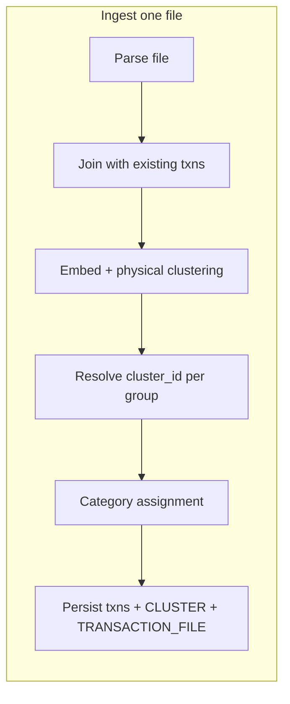

# Importing transaction files (clustering & cluster identity)

This document is the **detailed design** for the server-side import pipeline: how parsed rows become persisted transactions, how **cluster identity** is chosen or revised across imports, and what must be written to the database. It does **not** replace file-to-field rules ([`import_field_mapping.md`](./import_field_mapping.md)), the **HTTP/JSON** contract ([`api_contract.md`](./api_contract.md)), or the **physical** DynamoDB layout ([`database/data_model.md`](./database/data_model.md)); it sits between them and the clustering behaviour already discussed at a high level in [`transaction_analysis_clusters_and_categories.md`](./transaction_analysis_clusters_and_categories.md).

**Status:** This document specifies **intended** behaviour, including product decisions not yet fully implemented. Implementation should follow it in phases; the repo may still reflect the **legacy** “full re-embed, medoid `CL_*` every import” path until that work is done.

---

## 1. Goals

- **Clarity:** Anyone extending imports, review, or tag rules can see how `cluster_id` is born, **stabilized**, **split**, **merged**, or **left unset**.
- **User trust:** When embedding groups stay coherent with a prior **store-wide** view of a cluster, **do not** churn cluster ids without cause.
- **Honesty on change:** When embedding groups **diverge** (split) or **unify** (merge), **retire** old cluster keys for tag/review purposes and require **new** category decisions where the product says “new cluster ⇒ new category expectations.”
- **Durability:** **Every** change to a transaction’s `cluster_id` (including clearing it) is **persisted** on the **transaction** item in DynamoDB, with **GSI1** and **`CLUSTER#…`** items updated consistently in the same or follow-up write strategy.

---

## 2. Scope

| In scope | Out of scope (see other docs or future work) |
|----------|---------------------------------------------|
| Multi-file, multi-import lifecycle for **cluster id** and **category** as driven by the pipeline | Exact embedding model, `DBSCAN` hyperparameters, or ML notebook workflows |
| Rules for **split**, **merge**, **conservation**, **unassigned** (`null`) | CSV/OFX column mapping (see `import_field_mapping.md`) |
| DB write requirements for transactions and cluster aggregates | Frontend UX copy and API pagination details not tied to import |

---

## 3. Terminology

| Term | Meaning |
|------|--------|
| **Parsed row** | Normalized line from a file (`date`, `amount`, `raw_merchant`, …) before persistence. |
| **Source row (pipeline)** | Either an **existing** `TransactionRecord` from the store or a **new** parsed row to be inserted. |
| **Physical cluster (embedding group)** | A set of source rows that receive the **same** label from the embedding step and density clustering (e.g. DBSCAN on cosine distance). The algorithm groups **indices**, not old ids. |
| **`cluster_id` (logical)** | The string id stored on each transaction, used in `CLUSTER#<cluster_id>` items and in `GSI1PK` (see data model). May be **absent** or **`null`** when no cluster is assigned. |
| **Conservation** | A policy outcome where the new physical groups still match **one** prior logical cluster, so the **previous** `cluster_id` is kept for the whole group. |
| **Split** | One prior `cluster_id` (or a single historical grouping) is represented in **more than one** new physical group after re-clustering. |
| **Merge** | One new physical group contains **more than one** distinct prior non-null `cluster_id` among **existing** transactions. |
| **Retire (a cluster id)** | No transaction points to that `cluster_id` after commit; the **`CLUSTER#…`** item is obsolete for live rules and can be pruned or tombstoned per ops policy. |

---

## 4. High-level pipeline

Imports are not “append-only clustering on new file rows.” A run always has access to **all** existing user transactions in the store (or a defined subset if later optimized) and the **new** file’s rows.

1. **Parse** the upload into canonical rows (see `import_field_mapping.md`).
2. **Join** with existing stored transactions in a deterministic order (e.g. by date, then id).
3. **Normalize** merchant text for embedding; **compute** embeddings (same model as product policy).
4. **Cluster in embedding space** (e.g. DBSCAN + singleton handling) to produce **physical groups** of indices.
5. **Resolve `cluster_id`** for each group using the rules in [§5](#5-cluster-identity-resolution) (conservation, split, merge, new id, or `null`).
6. **Assign category** per group and per product rules (inheritance from existing `CLASSIFIED` rows, rules, ML, review) with explicit handling when [§5](#5-cluster-identity-resolution) forces **new** clusters and thus **new** category expectations (see [§6](#6-category-and-new-clusters)).
7. **Write back** all affected transactions and cluster aggregates, ensure **patches** for existing keys and **puts** for new ones (see [§7](#7-persistence-and-write-back)), and record **import file** metadata (`TRANSACTION_FILE` in [`data_model.md`](./database/data_model.md), [`api_contract.md`](./api_contract.md) `importFileId` / `GET /api/transaction-files`).

---

## 5. Cluster identity resolution

This section is the **authoritative** ruleset. Implementation may batch steps for performance; behaviour must be equivalent.

### 5.1 Inputs per physical group

For each **physical group** (list of source indices and rows):

- Collect **`previous_ids`**: the set of **non-null** `cluster_id` values on **existing** transactions in that group. New-only rows have no previous id; they contribute nothing to this set.
- Distinguish **new-only** groups (no existing transactions) from mixed or existing-only groups.

### 5.2 Conservation (carry the old id)

**When:** `previous_ids` has **exactly one** element `C`, and every **new** source row in the group is “without a previous cluster” (treated as compatible with carry). **Do not** carry if any existing in the group had a *different* non-null id than the others; that is a [merge](#54-merges) case.

**Then:** Set **`cluster_id = C`** for all rows in the group (existing + new). No new `CL_*` minted for that group in this case.

*Rationale:* The embedding run still regroups, but the group is **compatible** with a single legacy cluster, so the stable **logical** id is preserved, avoiding unnecessary churn on `GSI1` and `CLUSTER#…`.

### 5.3 Splits

**When:** The transactions that **previously** shared one non-null `cluster_id` `C` (from the last persisted state) are assigned by this run to **two or more** distinct physical groups. (Equivalently: `C`’s old members land in more than one embedding group.)

**Then:**

- For **each** of those groups, assign a **new** `cluster_id` (see [§5.6](#56-minting-new-cluster-ids)) distinct from all other new ids in the same run, and distinct from all retired ids.
- **Retire** `C` once all transactions that referenced `C` have been repointed to their new ids (or to `null` if an edge case is defined).

**Category:** Treated as **new clusters** in product terms: [§6](#6-category-and-new-clusters) applies; do not assume the old category of `C` automatically applies to both children without explicit inheritance rules.

### 5.4 Merges

**When:** A **single** physical group has `|previous_ids| > 1` (two or more distinct non-null `cluster_id`s among existing rows).

**Then:**

- Assign **one** new `cluster_id` to the **entire** group (existing + new rows in that group) via [§5.6](#56-minting-new-cluster-ids).
- **Retire** every id in `previous_ids` that is no longer referenced after this run.

*This matches the decision “for merges, do the same as [re-mint]” in the sense of **not** carrying either old id, because neither alone describes the new union.*

**Category:** New cluster: [§6](#6-category-and-new-clusters).

### 5.5 Unassigned cluster (`null`)

**When** the product chooses **not** to assign a `cluster_id` to a source row, persist **`cluster_id` as absent or `null`** (schema-level detail in `database/data_model.md` and types when implemented). Example triggers to define at implementation time:

- Isolated new rows in a new-only group where policy says “defer until a later import or more density.”
- Existing rows that already had `null` and are still in a no-assignment state.
- Optional: rows filtered out of clustering for confidence or data-quality reasons.

**Then:** **Do not** fabricate a `GSI1` key that implies a false cluster. Items **without** a cluster should **omit** `GSI1PK` / `GSI1SK` (or equivalent) so they do not appear under a real cluster in `GSI1` [§7.2](#72-gsi1-and-unclustered-transactions). Future imports re-run embedding; a later run may place the row in a group that **does** get an id (conservation or new mint).

### 5.6 Minting new cluster ids

When a **new** id is required, use a **single** product-wide scheme (e.g. medoid of normalized text + hash, or UUID with `CL_` prefix), documented in the implementation PR. The important property is **uniqueness** per user scope and **stability** after assignment until a later split/merge/retire policy changes it.

---

## 6. Category and “new” clusters

- **Inheritance** from existing `CLASSIFIED` **transactions** in the same **resolved** `cluster_id` group remains a strong default *when* the row still participates in a single classified lineage (align with the spirit of today’s `inheritedCategoryForGroup`, adapted to `null` and new-id cases).
- **After a split or merge** that [§5](#5-cluster-identity-resolution) answers with **new** cluster ids, treat the resulting clusters as **needing a fresh category line** in product terms: the UI and rules should not silently assume the pre-split / pre-merge category for **both** new ids without an explicit rule (e.g. copy-suggestion, review queue, or “inherit once” policy—**product choice**; document the chosen default in a follow-on PR).

---

## 7. Persistence and write-back

### 7.1 Transactions

- **Every** transaction (existing and newly inserted) that receives a new `cluster_id` or a change from a non-null id to `null` (or the reverse) must be **written** in the import commit path.
- **Order:** Define a **safe order** in implementation (e.g. compute full **desired** state in memory, then **patch/put** so no transaction ever references a **retired** `cluster_id` as its current value after the batch completes, except transient failure paths which must be retried or reconciled).
- **Existing transactions** only touched by the pipeline go through the same patch path as today’s `patchExistingTransactionsAfterImport` concept; **new** rows go through the ingest batch.

### 7.2 GSI1 and unclustered transactions

- `GSI1` exists to find **all** transactions in a user’s cluster for tag rules and similar ([`database/data_model.md`](./database/data_model.md)).
- If `cluster_id` is **`null`**, the transaction should **not** project a misleading `GSI1PK` tied to a non-existent or deprecated cluster. Prefer **omitted** GSI1 attributes; confirm DynamoDB’s projection behaviour in implementation so unclustered items do not appear in `GSI1` under a fake key.

### 7.3 `CLUSTER#…` items

- **Upsert** or **prune** `CLUSTER#…` items so that each **live** `cluster_id` that has at least one transaction has consistent aggregate metadata; **retired** ids should have their items removed, tombstoned, or left for garbage collection, per a single project policy, without breaking queries that list “pending” clusters.
- A **conservation** that keeps the same `cluster_id` should **not** create duplicate or conflicting `CLUSTER#` rows; merges and splits that mint new ids must **not** leave old `CLUSTER#` as authoritative for tag rules (retirement).

### 7.4 Retirement

- **Retire** an old id when no transaction’s **current** `cluster_id` equals that id at end of the batch.
- Optional **background** pass: delete orphan `CLUSTER#` items, or do it in the same import transaction if batching allows.

### 7.5 Import file history (`FILE#…` / `TRANSACTION_FILE`)

- After a **successful** `POST /api/imports` (including zero ingested rows), the server **puts** one **`TRANSACTION_FILE`** item per run. The stored shape is **sectioned** to follow the import run: **`source`** (uploaded file: `name`, `size_bytes`, optional `content_type`), **`format`** (optional `source_format` after sniffing for parse), **`timing`** (`started_at` right after a successful extract, `completed_at` when the run finishes), and **`result`** (full **`ImportIngestResult`**, including `existingTransactionsUpdated` from the re-cluster patch list — see `TransactionFileInput` / `ImportIngestResult` in `db/src/types.ts`). `GET /api/transaction-files` returns the same structure (`TransactionFileRecord`).
- **Legacy** DynamoDB items may still use the older `file_import` + `ingest` (+ optional `name` / `imported_at` / `row_count`) layout; the repository maps them to the current **`TransactionFileRecord`** shape for the API. Do not expect automated backfills; see the data model.
- These rows are **not** part of the clustering pipeline; they exist so clients can list which files were ingested via **`GET /api/transaction-files`**. See [`database/data_model.md`](./database/data_model.md) §3 and [`api_contract.md`](./api_contract.md).
- **No migration policy (early):** do not invest in backfills for old `TRANSACTION_FILE` shapes; if items are wrong or pre-date required attributes, **delete them after explicit approval** (or clear non-prod user data) rather than in-place migration—see the **Schema changes / existing data** note in the data model.

---

## 8. Split / merge detection (implementation note)

To implement [§5.3](#53-splits) and [§5.4](#54-merges) deterministically, one approach (not the only one):

1. After physical clustering, for each old id `C` (appearing on any **existing** transaction in the join set), list which **physical group indices** contain at least one transaction with `cluster_id === C`. If that list has length &gt; 1 → **split** for `C`.
2. For each **physical** group, if `previous_ids` has size &gt; 1 → **merge** for that group.
3. Apply **conservation** only when a group is merge-free, split-free for its ids, and [§5.2’s](#52-conservation-carry-the-old-id) conditions hold.

Tie-breaks and ordering of application must be **deterministic** (e.g. process groups in sorted order of `cluster_id` or min index).

---

## 9. API and contract impacts (when implemented)

- Transaction JSON may expose `cluster_id` as **`string | null`** if the product surfaces unclustered state.
- Import **response** may continue to return counts; optional extension: report **splits/merges/retirements** for debugging and UI messaging (non-breaking if omitted).
- **Import file history** is documented in [`api_contract.md`](./api_contract.md) (`importFileId` on `POST /api/imports`, `GET /api/transaction-files`) and persisted per [`database/data_model.md`](./database/data_model.md) `TRANSACTION_FILE`.
- Update [`api_contract.md`](./api_contract.md) and [`database/data_model.md`](./database/data_model.md) in the **same** change that ships behaviour.

---

## 10. Open questions (to close before or during implementation)

1. **First import, all new rows:** Should every row always receive a new minted `cluster_id` when physically clustered, or may some be deliberately `null` (e.g. large noise set)?
2. **Minimum group size** for DBSCAN: still `min_samples = 3`? Does that interact with `null` policy for “singleton until next import?”
3. **Tag rule** on a cluster id the moment before retirement: is **atomic** re-tag to new ids required, or is a short window without rules acceptable?
4. **Review queue** rows keyed by `cluster_id`: confirm UI invalidation when an id is retired in the same import.

---

## 11. Document maintenance

- When the import pipeline or persistence rules change, update **this** file and [`database/data_model.md`](./database/data_model.md) as needed; when import **history** API or `TRANSACTION_FILE` attributes change, update [`api_contract.md`](./api_contract.md) in the same change.
- The Design Architect and `db_admin` skills treat these as a **living** contract with the code.

---

## Related documents

| Document | Relationship |
|----------|--------------|
| [`import_field_mapping.md`](./import_field_mapping.md) | Upstream: file → parsed row. |
| [`api_contract.md`](./api_contract.md) | Wire types and import response. |
| [`database/data_model.md`](./database/data_model.md) | DynamoDB attributes, `GSI1`, `CLUSTER#` and `FILE#` / `TRANSACTION_FILE` items; update when `cluster_id` can be `null`. |
| [`transaction_analysis_clusters_and_categories.md`](./transaction_analysis_clusters_and_categories.md) | Business rules and ML context; must stay consistent on cluster meaning. |
| [`../02_architecture/02_data_flow.md`](../02_architecture/02_data_flow.md) | Where import sits in the system story. |
