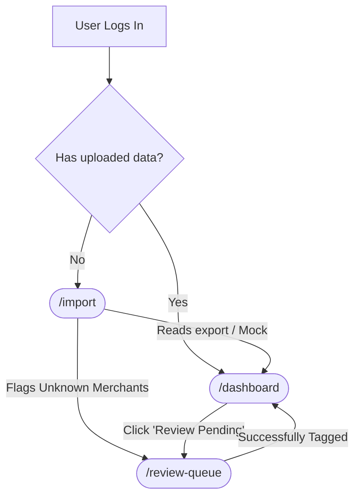

# UI Component Flow & MVP Use Cases

To fulfill the "Stage 1: Clarity & Understanding" requirement successfully, the Frontend architecture must rigidly support three core user journeys (use cases). Below is the breakdown of the exact React pages and components required to deliver them.

## 1. Use Case: Initial Data Ingestion
**Goal**: A user with no data needs to get historical transactions from their bank into the platform painlessly. Supported export formats include **CSV**, **OFX**, **QFX** (OFX variant), and **QIF**; the backend normalizes to a common transaction model.
**What the UI must show**: A clear, trustworthy drag-and-drop zone with format instructions, followed by a reassuring loading state while the parser runs locally (or mocked).

* **Route**: `/import`
* **Page component**: `<DataImportPage />`
* **Data**: `GET /api/transaction-files` (via `useTransactionFiles`) lists prior imports — each entry includes `source` (upload name, size, MIME), `format` (detected `source_format` when known), `timing` (start/complete), and `result` (row counts and re-cluster stats) for an audit trail; refreshed after a successful `POST /api/imports`. See [`api_contract.md`](./api_contract.md).
* **Child Components**:
  - `<ImportDropzone />`: Handles HTML5 drag-and-drop file reading (filtered by supported extensions/MIME types).
  - `<UploadProgressIndicator />`: Displays standard processing metrics (e.g., "Parsing 340 transactions...").
  - `<ImportSummaryCard />`: Shows success metrics ("We found 290 known merchants, and 50 unknown").
  - **Import history** (same page): shows recorded file names and dates from the API.

## 2. Use Case: "The Baseline Reality Check" (Main Dashboard)
**Goal**: The core of the MVP. The user logs in to see an undeniable, clear picture of their net worth, cash flow, and where their money goes.
**What the UI must show**: High-contrast, non-judgmental facts. Smooth charts for visual consumption and clear categorization lists.

* **Route**: `/dashboard`
* **Page component**: `<DashboardPage />`
* **Child Components**:
  - `<NetWorthHero />`: A large glassmorphism widget showing total liquid assets vs liabilities.
  - `<MonthlyCashFlowChart />`: A line graph component plotting `Money In` vs `Money Out`.
  - `<CategorySpendBreakdown />`: Progressive bar charts mapping spending to our 10 established Taxonomy categories.
  - `<RecurringSubscriptionsList />`: A simple list isolating detected recurring charges.

## 3. Use Case: Active Learning (Reviewing Clusters)
**Goal**: The system groups unknown or messy merchants into similar "Clusters" (e.g. grouping `SQ * LOCAL COFFEE` and `LOCAL COFFE`). The user must assign a category to the entire Cluster. This manual confirmation teaches the ML engine to automatically categorize any future uploaded transactions that match this cluster's parameters.
**What the UI must show**: A focused "to-do list" of identified ambiguous clusters. It must highlight sample raw merchant names within the cluster, the total volume/amount affected, and provide an intuitive dropdown to select a master category for the cluster.

* **Route**: `/review-queue`
* **Page component**: `<ReviewQueuePage />`
* **Child Components**:
  - `<QueueStatusHeader />`: Shows how many unique clusters are currently awaiting review.
  - `<AmbiguousClusterList />`: The parent container serving the grouped data.
  - `<ClusterReviewRow />`: The interactive row displaying sample messy strings, total occurrences, and the aggregate amount.
  - `<CategorySelectDropdown />`: A searchable dropdown loaded with the 10 core taxonomy categories.
  - `<ConfirmClusterTagButton />`: Submits the mapping, permanently associating all current and future transactions inside that cluster with the new category.

---
## UI Component Flow Diagram

