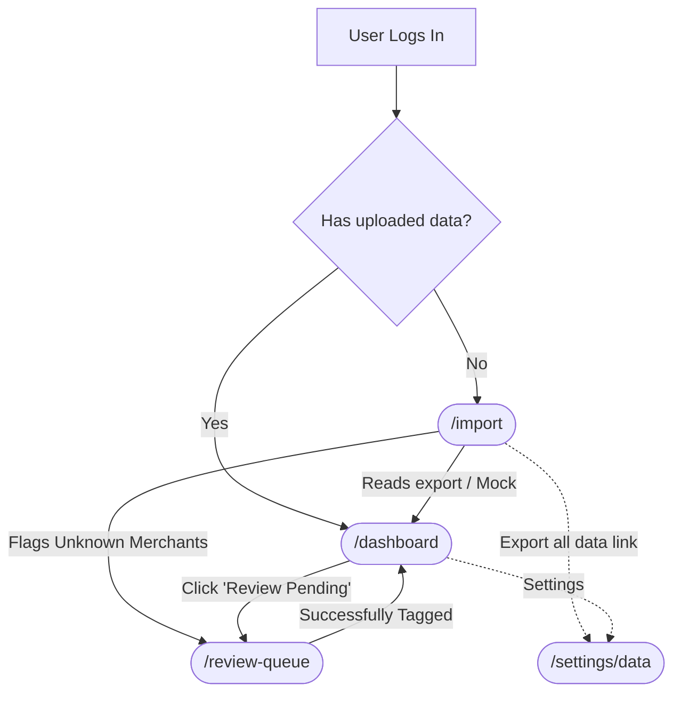

# UI Component Flow & MVP Use Cases

To fulfill the "Stage 1: Clarity & Understanding" requirement successfully, the Frontend architecture must rigidly support the core user journeys below (use cases). Below is the breakdown of the exact React pages and components required to deliver them.

## 1. Use Case: Initial Data Ingestion
**Goal**: A user with no data needs to get historical transactions from their bank into the platform painlessly. Supported export formats include **CSV**, **OFX**, **QFX** (OFX variant), and **QIF**; the backend normalizes to a common transaction model.
**What the UI must show**: A clear, trustworthy drag-and-drop zone with format instructions, followed by a reassuring loading state while the parser runs locally (or mocked).

* **Route**: `/import`
* **Page component**: `<DataImportPage />`
* **Data**: `GET /api/transaction-files` (via `useTransactionFiles`) lists prior imports — each entry includes `source` (upload name, size, MIME), `format` (detected `source_format` when known), `timing` (start/complete), and `result` (row counts and re-cluster stats) for an audit trail; refreshed after a successful `POST /api/imports`. See [`api_contract.md`](./api_contract.md).
* **Child Components**:
  - `<ImportDropzone />`: Handles HTML5 drag-and-drop file reading (filtered by supported extensions/MIME types).
  - `<UploadProgressIndicator />`: Displays standard processing metrics (e.g., "Parsing 340 transactions...").
  - `<ImportSummaryCard />`: Shows success metrics ("We found 290 known merchants, and 50 unknown").
  - **Import history** (same page): shows recorded file names and dates from the API.

## 2. Use Case: "The Baseline Reality Check" (Main Dashboard)
**Goal**: The core of the MVP. The user logs in to see an undeniable, clear picture of their net worth, cash flow, and where their money goes.
**What the UI must show**: High-contrast, non-judgmental facts. Smooth charts for visual consumption and clear categorization lists.

* **Route**: `/dashboard`
* **Page component**: `<DashboardPage />`
* **Child Components**:
  - `<NetWorthHero />`: A large glassmorphism widget showing total liquid assets vs liabilities.
  - `<MonthlyCashFlowChart />`: A line graph component plotting `Money In` vs `Money Out`.
  - `<CategorySpendBreakdown />`: Progressive bar charts mapping spending to our 10 established Taxonomy categories.
  - `<RecurringSubscriptionsList />`: A simple list isolating detected recurring charges.

## 3. Use Case: Active Learning (Reviewing Clusters)
**Goal**: The system groups unknown or messy merchants into similar "Clusters" (e.g. grouping `SQ * LOCAL COFFEE` and `LOCAL COFFE`). The user must assign a category to the entire Cluster. This manual confirmation teaches the ML engine to automatically categorize any future uploaded transactions that match this cluster's parameters.
**What the UI must show**: A focused "to-do list" of identified ambiguous clusters. It must highlight sample raw merchant names within the cluster, the total volume/amount affected, and provide an intuitive dropdown to select a master category for the cluster.

* **Route**: `/review-queue`
* **Page component**: `<ReviewQueuePage />`
* **Child Components**:
  - `<QueueStatusHeader />`: Shows how many unique clusters are currently awaiting review.
  - `<AmbiguousClusterList />`: The parent container serving the grouped data.
  - `<ClusterReviewRow />`: The interactive row displaying sample messy strings, total occurrences, and the aggregate amount.
  - `<CategorySelectDropdown />`: A searchable dropdown loaded with the 10 core taxonomy categories.
  - `<ConfirmClusterTagButton />`: Submits the mapping, permanently associating all current and future transactions inside that cluster with the new category.

## 4. Use Case: Data backup & restore (safety)

**Goal**: Users can download a **complete snapshot** of their financial data held by the app and later **restore** it — especially before risky actions or when migrating devices. Restore **replaces all** current app data for that user with the snapshot (**no merge**); see [`stage_1_understanding_mvp.md`](../01_discovery/stage_1_understanding_mvp.md) §2 and [`api_contract.md`](./api_contract.md) §6.

**What the UI must show**: Plain-language warnings on restore, a trustworthy export action, and progress/error states. Destructive confirmation must not be easy to mis-click.

---

### 4.1 Summary of UI changes (implementation checklist)

| Area | Change |
|------|--------|
| **Product scope (V1)** | Backup JSON is **synchronous** and **metadata-only** (no raw bank files in the artifact). Restore uses **staging DynamoDB table** then swap onto primary — see [`database/data_model.md`](./database/data_model.md) §8.2–8.4 and [`api_contract.md`](./api_contract.md) §6. |
| **Routing** | Register **`/settings/data`** under the authenticated layout (same tree as `import`, `dashboard`). Example: add `<Route path="settings/data" element={<DataBackupSettingsPage />} />` inside `<AppLayout />` in [`frontend/src/App.tsx`](../../frontend/src/App.tsx). |
| **Navigation — Settings** | The sidebar **Settings** control is currently non-functional ([`AppLayout.tsx`](../../frontend/src/components/layout/AppLayout.tsx)). Wire it to **`NavLink to="/settings/data"`** (or open a small settings hub first if you add more routes later). Use **`aria-current`** when path matches. |
| **Navigation — Import** | On [`DataImportPage`](../../frontend/src/pages/DataImportPage.tsx), add a tertiary text link **“Download all my data”** (or **“Backup & restore”**) → **`/settings/data`** below the fold or in the page header helper strip — does not replace the primary import CTA. |
| **API layer** | Add `getBackupExport()` (download blob / trigger save-as), **`postBackupRestore(file)`**, and **`postBackupRestoreAbort()`** in [`frontend/src/api/client.ts`](../../frontend/src/api/client.ts); extend [`frontend/src/lib/types.ts`](../../frontend/src/lib/types.ts) with **`BackupRestoreResponse`**, **`BackupRestoreAbortResponse`**. Optional hooks: `useBackupExport`, `useBackupRestore`, **`useBackupRestoreAbort`**. |
| **New page** | New file **`frontend/src/pages/DataBackupSettingsPage.tsx`** composing the components below; match existing page padding/typography (`max-w-6xl` is already applied by layout). |

---

### 4.2 Page layout (`DataBackupSettingsPage`)

Single scrollable page with a clear title and two primary sections (visual separation: cards or `divide-y`):

1. **Backup (export)** — top section; non-destructive; reassuring tone.
2. **Restore** — below; bordered or tinted **warning** band so it never looks like a secondary export action.

Suggested title: **“Your data”** or **“Backup & restore”**. Subtitle one line: backups are **encrypted in transit** (HTTPS) and the downloaded file is **sensitive** — store offline / encrypted disk.

---

### 4.2a Stuck restore — abort cleanup

When **`restore_in_progress`** is visible (**`RESTORE_LOCK`** — [`database/data_model.md`](./database/data_model.md) §8.2a; surfaced via optional **`GET /api/me`** / profile field **or** after **`POST /api/backup/restore`** ends with **500** / timeout):

- Show a **banner** on **`/settings/data`** (optional global shell): **“A restore may still be locked.”** Copy: abort clears **`RESTORE_LOCK`** **first** so retry isn’t blocked by **409**, **then** removes staging debris ([`database/data_model.md`](./database/data_model.md) §8.2b); it **does not stop** server work if a restore were still executing ([`api_contract.md`](./api_contract.md) §6 **Abort**; V1 assumes restore **already stopped**).
- Button **“Clear restore lock”** → **`POST /api/backup/restore/abort`**; toast on success; if **`500`** with staging incomplete, **retry** abort ([`api_contract.md`](./api_contract.md) §6 partial failure); invalidate queries; hide banner when **`200`**.

---

### 4.3 Backup (export) UX

| State | UI behaviour |
|-------|----------------|
| **Idle** | `<BackupSummaryCard />`: bullet list of what the JSON contains (accounts, transactions, clusters, import history, profile; metrics optional — per [`database/data_model.md`](./database/data_model.md) §8). Primary button **“Download backup”**. Secondary microcopy: “Keep this file private.” |
| **Loading** | Disable button; `<BackupDownloadProgress />` with spinner and **“Preparing download…”** (indeterminate). |
| **Success** | Browser saves file (`Content-Disposition` from server when present); toast **“Backup downloaded”**; re-enable button. |
| **Error** | Inline alert (401 / 500); **“Try again”**; do not leave partial file on disk without user action (client receives full body or error only). |

**Implementation note:** use `fetch` with auth headers → `blob()` → object URL + programmatic `<a download>` for consistent filenames (`housef4-backup.json` fallback).

---

### 4.4 Restore UX (`<RestoreWizard />` stepper)

Present as **numbered steps** or a compact stepper component; **only step 4** calls the API.

| Step | Component | UI behaviour |
|------|-----------|----------------|
| **1** | `<RestoreFilePicker />` | Drag-and-drop + file button; `accept=".json,application/json"`; max size hint if API limits exist. Show chosen **filename** only — no upload yet. **Next** disabled until file selected. |
| **2** | `<RestoreManifestPreview />` | Parse JSON client-side (`backup_schema_version`, `exported_at`, derive counts from array lengths). If parse fails → blocking error **“This file doesn’t look like a Housef4 backup.”** Do **not** render transaction tables or PII previews. **Back** / **Next**. |
| **3** | Confirmation | Alert severity **warning**: **“Restoring replaces all data in this app. This cannot be undone.”** Checkbox **required**: “I understand all current data will be **permanently replaced**.” Text field: user types **`RESTORE`** (case-sensitive) to enable **“Start restore”**. **Back** disabled or allowed only before submit. |
| **4** | `<RestoreProgressPanel />` | Submit **`POST /api/backup/restore`** with `FormData` + `backup` part. Progress: **“Uploading…”** then **“Restoring…”** (indeterminate unless server streams progress). |

**Outcome states**

| Result | UI |
|--------|-----|
| **Success** | Show **`restored`** counts from JSON (`accounts`, `transactions`, …). Primary **“Go to dashboard”** → **`/dashboard`**. Run **query invalidation** for all finance queries (`['transactions']`, `['metrics']`, `['review-queue']`, `['accounts']`, `['transaction-files']` or global reset). |
| **403** | Clear message: backup belongs to **another account** — wrong file. |
| **400** | Schema/version mismatch or validation — suggest re-export from app. |
| **500** | Generic failure + support hint; offer **“Clear restore lock”** ( **`POST /api/backup/restore/abort`** ) when **`RESTORE_LOCK`** may remain — [`api_contract.md`](./api_contract.md) §6. Advise refresh after abort before retrying restore. |

---

### 4.5 Accessibility & safety

- **Focus**: Move focus to step headings on step change; trap focus inside wizard modal **if** restore is implemented as a modal (full-page wizard avoids modal trap complexity).
- **Restore button**: Use **`danger`** / destructive styling only on final submit; never style step 1–2 as primary red.
- **Screen readers**: Announce **“Restore complete”** / failures via **`role="status"`** or live region.

---

### 4.6 Component inventory (names)

- `<DataBackupSettingsPage />` — page shell.
- `<BackupSummaryCard />` — export intro + primary download CTA.
- `<BackupDownloadProgress />` — loading UI for export.
- `<RestoreWizard />` — orchestrates steps 1–4.
- `<RestoreFilePicker />`, `<RestoreManifestPreview />`, `<RestoreProgressPanel />` — as described above.
- **`<RestoreStuckBanner />`** (optional name) — **`restore_in_progress`** + **`POST /api/backup/restore/abort`** entry point (§4.2a).

---

### 4.7 Related specs

- HTTP contract: [`api_contract.md`](./api_contract.md) §6 — **`GET /api/backup/export`**, **`POST /api/backup/restore`**, **`POST /api/backup/restore/abort`**.
- Snapshot schema: [`database/data_model.md`](./database/data_model.md) §8.

---
## UI Component Flow Diagram

